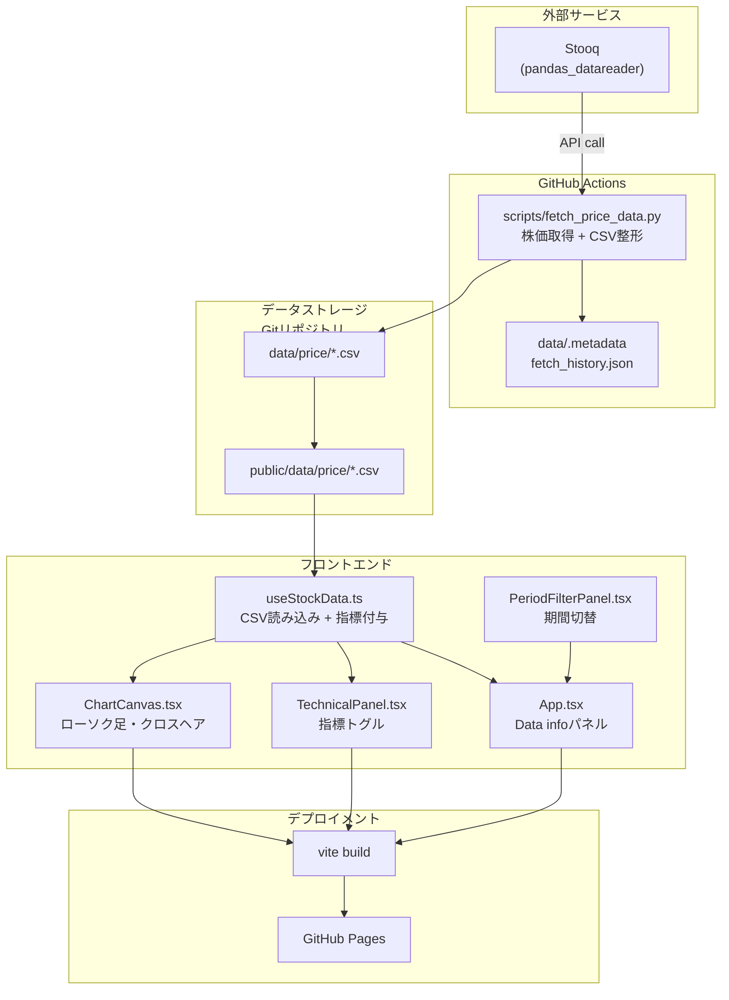
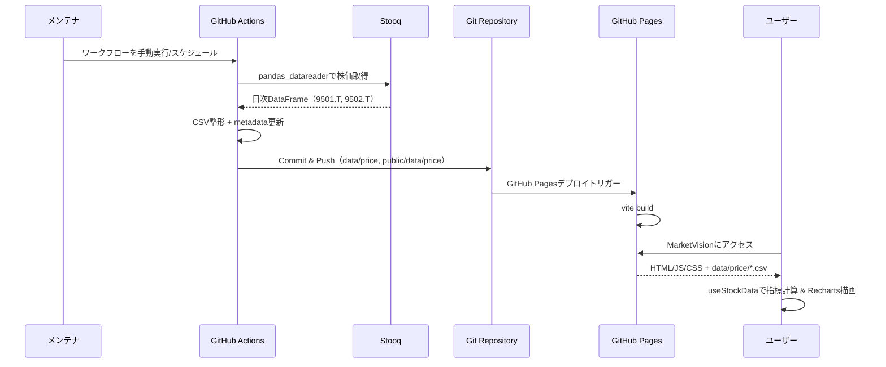

# 実装計画書: MarketVision 株価テクニカル分析ダッシュボード

**Branch**: `001-marketvision-implementation` | **Date**: 2025-12-15 | **Spec**: [spec.md](https://github.com/J1921604/MarketVision/blob/main/specs/001-marketvision-implementation/spec.md)  
**Input**: [機能仕様書](https://github.com/J1921604/MarketVision/blob/main/specs/001-marketvision-implementation/spec.md)  
**Version**: 1.0.0

## 概要

東京電力HD（9501.T）・中部電力（9502.T）の株価データを視覚化し、テクニカル指標（SMA、RSI、MACD、ボリンジャーバンド）を重ね表示するインタラクティブなダッシュボードをGitHub Pages上で提供します。

**技術アプローチ**:
- フロントエンド: React 18 + TypeScript + Viteによる静的サイト生成
- データ取得: `pandas_datareader` (Stooq) をGitHub Actionsで定期実行
- テクニカル指標計算: Python 3.11 + pandas/numpyによるバッチ処理
- デプロイ: GitHub Pages（静的ホスティング）

---

## 技術コンテキスト

### フロントエンド

**言語/バージョン**: TypeScript 5.3 + React 18.2  
**ビルドツール**: Vite 5.0  
**主要依存関係**:
- `recharts` 2.10 - チャート描画ライブラリ
- `tailwindcss` 3.4 - スタイリングフレームワーク
- `papaparse` 5.4 - CSVパースライブラリ

**テスト**: Vitest (ユニット) + Playwright (E2E)  
**対象プラットフォーム**: モダンブラウザ（Chrome 90+、Firefox 88+、Safari 14+）  
**パフォーマンス目標**:
- LCP (Largest Contentful Paint) < 2.5秒
- TTI (Time to Interactive) < 2.0秒
- 初期バンドルサイズ（gzip後）< 200KB
- チャート再描画 < 200ms

**制約**:
- 静的サイトのため、サーバーサイドロジックなし
- すべてのデータはビルド時またはGitHub Actionsで事前生成
- ブラウザのローカルストレージを使用した期間フィルタ状態の永続化

**スケール/スコープ**:
- 2銘柄（9501.T、9502.T）
- 過去5年間の日次データ（約1250レコード/銘柄）
- 初期ロードサイズ < 500KB（全データ含む）

### バックエンド（データ処理）

**言語/バージョン**: Python 3.11  
**主要依存関係**:
- `pandas_datareader` - Stooqからのデータ取得
- `pandas` 2.1 - データ処理と変換
- `numpy` 1.26 - テクニカル指標計算

**ストレージ**: ファイルシステム（CSV/JSON）
- `data/price/{symbol}.csv` - 株価データ
- `data/indicators/{symbol}_{indicator}.csv` - テクニカル指標
- `data/events/corporate_events.json` - イベントマーカー

**テスト**: pytest (ユニット) + データ検証スクリプト  
**実行環境**: GitHub Actions Ubuntu latest  
**パフォーマンス目標**:
- データ取得（2銘柄）< 60秒
- テクニカル指標計算（全指標）< 10秒
- データ検証 < 5秒

**制約**:
- Stooqの利用規約を遵守
- エラー時の最大リトライ回数: 3回（指数バックオフ）

**スケール/スコープ**:
- 日次バッチ処理（GitHub Actions Cron: 毎時実行）
- 処理対象: 2銘柄
- 生成ファイル数: 約14ファイル（価格2 + 指標12）

### デザインシステム

**テーマ**: Cyberpunk Neumorphism  
**カラーパレット**:
- `--bg`: #0A0F0F（ダーク基調）
- `--fg`: #E6F5F1（フォアグラウンド）
- `--neon-green`: #00FF84（アクセント）
- `--cyan`: #00D4FF（東京電力HD）
- `--magenta`: #FF2ECC（中部電力）

**アクセシビリティ**: WCAG 2.1 AA準拠
- コントラスト比: 4.5:1以上
- キーボードナビゲーション対応
- ARIAラベル設定

**レスポンシブ対応**:
- デスクトップ: 1280px以上
- タブレット: 768px～1279px（チャートを縦積み）
- モバイル: 768px未満（機能制限版、アラートとタイルのみ）

---

## Constitution Check

*GATE: Phase 0調査前に通過必須。Phase 1設計後に再確認。*

### ✅ I. テスト駆動開発（TDD）の徹底

**遵守状況**: ✅ 合格
- すべてのテストケースを仕様書の受入シナリオから派生させる
- 実装前にユニットテスト（Vitest）とE2Eテスト（Playwright）を作成
- カバレッジ目標: 80%以上

**検証方法**:
- PRテンプレートにテストコード必須チェック項目を追加
- CI/CDでカバレッジ80%未満の場合はビルド失敗

---

### ✅ II. セキュリティ最優先

**遵守状況**: ✅ 合格
- `.env.local`ファイルは`.gitignore`で除外
- エラーログに機密情報を含めない設計

**検証方法**:
- コミット前に`git-secrets`でスキャン

---

### ✅ III. パフォーマンス基準の定量化

**遵守状況**: ✅ 合格
- LCP < 2.5秒、TTI < 2.0秒、初期ロード < 500KB、チャート再描画 < 200ms
- すべて仕様書（FR-013、SC-001～SC-003）で定量化済み

**検証方法**:
- Lighthouse CIでビルドごとに測定（スコア90以上必須）
- パフォーマンス基準未達成のPRはマージ拒否

---

### ✅ IV. API利用制限の厳守

**遵守状況**: ✅ 合格
- Stooq (pandas_datareader) の利用規約を遵守
- 過度なリクエストを避ける設計（GitHub Actionsでの定期実行のみ）

**検証方法**:
- GitHub Actionsワークフローで実行頻度を管理

---

### ✅ V. データ品質の保証

**遵守状況**: ✅ 合格
- すべてのCSV/JSONにスキーマバージョンを記載
- データ更新後に`validate_data.py`でスキーマ検証を実行
- 異常値（株価0円以下、前日比500%超）を検出してアラート発行

**検証方法**:
- CI/CDでデータ検証ステップを必須化
- 検証失敗時はデプロイを中止

---

## プロジェクト構造

### ドキュメント（本機能）

```text
specs/001-marketvision-implementation/
├── spec.md              # 機能仕様書
├── plan.md              # 本実装計画書
├── research.md          # Phase 0: 調査レポート
├── data-model.md        # Phase 1: データモデル定義
├── quickstart.md        # Phase 1: クイックスタートガイド
├── contracts/           # Phase 1: API契約
│   ├── data-schemas.json
└── checklists/
    └── requirements.md  # 仕様品質チェックリスト
```

### ソースコード（リポジトリルート）

```text
MarketVision/
├── .github/
│   ├── workflows/
│   │   ├── deploy-pages.yml          # GitHub Pagesデプロイ
│   │   └── update-data.yml           # データ更新（1時間毎）
│   ├── copilot-commit-message-instructions.md
│   └── prompts/                      # Speckit プロンプト
│
├── .specify/
│   ├── memory/
│   │   └── constitution.md           # プロジェクト憲法
│   ├── templates/
│   └── scripts/
│       └── powershell/
│           ├── setup-plan.ps1
│           ├── create-new-feature.ps1
│           └── update-agent-context.ps1
│
├── src/                              # フロントエンド（React）
│   ├── components/
│   │   ├── ChartCanvas.tsx          # チャートとクロスヘア描画
│   │   ├── PeriodFilterPanel.tsx    # 期間選択UI
│   │   └── TechnicalPanel.tsx       # テクニカル指標トグル
│   ├── hooks/
│   │   └── useStockData.ts          # CSV読み込み + 指標付与
│   ├── utils/
│   │   ├── dataFilters.ts           # 期間フィルタリング
│   │   └── indicators.ts            # SMA/RSI/MACD/BB計算
│   ├── types/
│   │   └── index.ts                 # ChartData型定義
│   ├── App.tsx
│   ├── index.css
│   ├── main.tsx
│   └── vite-env.d.ts
│
├── scripts/                          # データ取得（Python）
│   ├── fetch_price_data.py          # pandas_datareader経由のStooq取得
│   └── requirements.txt             # Python依存関係
│
├── data/                             # 生データ/メタデータ
│   └── price/
│       ├── 9501_T.csv               # 東京電力HD株価（開発用）
│       └── 9502_T.csv               # 中部電力株価（開発用）
│
├── public/
│   ├── data/
│   │   └── price/                   # GitHub Pages配信用CSV（上記のコピー）
│   │       ├── 9501_T.csv
│   │       └── 9502_T.csv
│   ├── favicon.ico
│   └── index.html
│
├── tests/
│   ├── unit/
│   │   ├── dataFilters.test.ts      # 期間フィルタロジック
│   │   └── indicators.test.ts       # 指標計算ユニットテスト
│   └── e2e/
│       └── dashboard.spec.ts        # Playwrightダッシュボードシナリオ
│
├── package.json
├── vite.config.ts
├── tsconfig.json
├── tailwind.config.js
├── playwright.config.ts
└── README.md
```

**構造決定の理由**:
- **Web application構造**を採用（フロントエンド + バックエンドデータ処理）
- フロントエンドは静的サイトだが、バックエンドスクリプトが別途存在するため分離
- GitHub Actionsで`scripts/`を実行し、`data/`を更新
- フロントエンドは`data/`から静的ファイルとしてデータを読み込む

---

## 複雑性の追跡

本プロジェクトは憲法の5原則すべてに違反していないため、このセクションは**不要**です。

---

## アーキテクチャ図

### システム全体フロー



### データフロー詳細



---

## 技術選定の根拠

### React 18 + TypeScript

**選定理由**:
- コンポーネントベース設計で、チャートやパネルを独立して開発・テスト可能
- TypeScriptによる型安全性で、データ構造の不整合を防止
- React Hooksで状態管理がシンプル（useStockDataなど最小構成で完結）

**代替案**:
- Vue.js 3: 学習コストは低いが、TypeScript統合がReactより弱い
- Svelte: ランタイムサイズは小さいが、エコシステムが未成熟

---

### Vite

**選定理由**:
- ビルド速度が高速（webpack比で約10倍）
- GitHub Pagesへの静的サイト生成が簡単（`vite build`）
- HMR（Hot Module Replacement）で開発体験が良好

**代替案**:
- webpack: 設定が複雑で、ビルド速度が遅い
- Parcel: ゼロコンフィグだが、カスタマイズ性が低い

---

### Recharts

**選定理由**:
- React専用チャートライブラリで、宣言的なAPI
- ローソク足、移動平均線、RSI、MACDなど金融チャートに対応
- レスポンシブ対応が標準搭載

**代替案**:
- D3.js: カスタマイズ性は高いが、学習コストが大きく開発期間が長期化
- Chart.js: 金融チャート（ローソク足）のサポートが弱い

---

### Tailwind CSS

**選定理由**:
- ユーティリティファーストで、Cyberpunk Neumorphismテーマの実装が容易
- CSS Variablesと組み合わせてダークモード対応
- ビルド時に未使用CSSを削除し、バンドルサイズを最小化

**代替案**:
- styled-components: CSS-in-JSだが、ランタイムオーバーヘッドがある
- Sass/SCSS: プリプロセッサだが、ビルド設定が複雑

---

### pandas_datareader (Stooq)

**選定理由**:
- 無料で日本株データにアクセス可能
- pandas DataFrameとして直接データを取得でき、処理が容易
- APIキー登録が不要

**代替案**:
- Alpha Vantage: 無料枠制限が厳しく、APIキー管理が必要
- Yahoo Finance API: 非公式APIで安定性が低い

---

### pandas + numpy

**選定理由**:
- テクニカル指標計算（SMA、RSI、MACD、ボリンジャーバンド）のライブラリが豊富
- CSVファイルの読み書きが高速
- ベクトル化演算で大量レコードの処理が数秒で完了

**代替案**:
- Pure Python: 計算速度が遅い
- TA-Lib: Cバインディングで高速だが、インストールが複雑

---

### GitHub Actions

**選定理由**:
- GitHubとのネイティブ統合で、追加のCI/CDツール不要
- Cronトリガーで定期実行が簡単（毎時実行: `0 */1 * * *`）
- Python 3.11とNode.js 20が標準でインストール済み

**代替案**:
- Jenkins: セルフホスティング必要で、運用コストが高い
- Circle CI: 無料枠が少なく、月間ビルド時間の制限が厳しい

---

### GitHub Pages

**選定理由**:
- 無料の静的ホスティングで、GitHub Actionsと自動連携
- カスタムドメイン対応（将来的に`marketvision.example.com`設定可能）
- HTTPS標準対応

**代替案**:
- Netlify: 無料枠が豊富だが、GitHub Pages以上の機能は不要
- Vercel: Next.jsに最適化されているが、本プロジェクトはVite

---

## データモデル設計

Phase 1で`data-model.md`として詳細化されますが、ここでは概要を示します。

### 主要エンティティ

1. **株価データ（PriceData）**
   - 属性: date, open, high, low, close, volume
   - 関係: 1銘柄に対して複数のPriceDataレコード
   - 検証ルール: close > 0、volume >= 0、date昇順

2. **テクニカル指標データ（IndicatorData）**
   - 属性: date, sma5, sma25, sma75, rsi14, macd, macd_signal, macd_hist, bb_upper, bb_middle, bb_lower
   - 関係: 1銘柄に対して複数のIndicatorDataレコード
   - 検証ルール: RSIは0～100、MACD差分が一致

3. **イベントデータ（EventData）**
   - 属性: date, symbol, type, label
   - 関係: 1銘柄に対して複数のEventDataレコード
   - 検証ルール: typeは earnings|ex-dividend|other

4. **アラートデータ（AlertData）**
   - 属性: timestamp, symbol, change_pct, trigger, close
   - 関係: 日ごとに複数のアラート可能
   - 検証ルール: |change_pct| >= 5

---

## リスクと軽減策

### リスク1: Stooqのサービス停止または仕様変更

**影響度**: 高（データ更新停止）  
**発生確率**: 低

**軽減策**:
- データ取得ロジックを抽象化し、他のデータソース（Yahoo Finance等）への切り替えを容易にする
- エラー時に前回の正常データを維持

### リスク2: GitHub Actionsの実行失敗

**影響度**: 中（データ更新失敗）  
**発生確率**: 低

**軽減策**:
- `validate_data.py`でデータ品質を検証し、異常時はコミットを中止
- GitHub Actionsの失敗時にIssue自動起票
- 週次でワークフロー実行履歴をレビュー

---

### リスク3: パフォーマンス基準未達成

**影響度**: 中（ユーザー体験低下）  
**発生確率**: 低

**軽減策**:
- Lighthouse CIでビルドごとに測定し、スコア90未満でPRマージ拒否
- 初期ロードサイズを500KB以下に制限（Viteのコード分割を活用）
- Rechartsの仮想化機能でチャート再描画を最適化

---

### リスク4: データ異常値の検出漏れ

**影響度**: 高（誤った投資判断）  
**発生確率**: 低

**軽減策**:
- `validate_data.py`で株価0円以下、前日比500%超を検出
- 異常値はチャートから除外し、アラートバナーで通知
- 毎週、データ品質レポートを自動生成してレビュー

---

## 次のステップ

### Phase 0: 調査とリサーチ（現在のフェーズ）

**目的**: Technical Contextの不明点（NEEDS CLARIFICATION）を解決

**タスク**:
1. Rechartsでのローソク足チャート実装パターンを調査
2. pandas/numpyでのテクニカル指標計算ベストプラクティスを調査
3. GitHub Actions Cronの信頼性と代替案（GitHub Scheduled Eventsなど）を調査

**成果物**: `research.md`

---

### Phase 1: 設計とコントラクト

**目的**: データモデル、API契約、クイックスタートガイドを詳細化

**タスク**:
1. `data-model.md`にすべてのエンティティとリレーションを記述
2. `contracts/data-schemas.json`にCSV/JSONのスキーマ定義を記述
3. `quickstart.md`に5分で動作確認できる手順を記述
4. `.specify/scripts/powershell/update-agent-context.ps1 -AgentType copilot`を実行

**成果物**: `data-model.md`, `contracts/`, `quickstart.md`

---

### Phase 2: タスク分解（次コマンド: `/speckit.tasks`）

**目的**: 実装タスクを優先順位付けし、ガントチャートを作成

**タスク**:
1. ユーザーストーリーごとにタスクを分解
2. 2025-12-15開始、土日祝日を考慮したスケジュール作成
3. 相対日付方式でガントチャートを記述（開始日変更に対応）

**成果物**: `tasks.md`

---

### Phase 3: 実装（次コマンド: `/speckit.implement`）

**目的**: 実装ブランチでコードを生成

**タスク**:
1. データ取得スクリプト（`scripts/fetch_price_data.py`）
2. テクニカル指標計算（`scripts/build_indicators.py`）
3. Reactダッシュボード（`src/`）
4. GitHub Actionsワークフロー（`.github/workflows/`）
5. ユニット/E2Eテスト（`tests/`）

**成果物**: 動作するアプリケーション

---

**Version**: 1.0.0  
**Last Updated**: 2025-12-15  
**Repository**: https://github.com/J1921604/MarketVision
