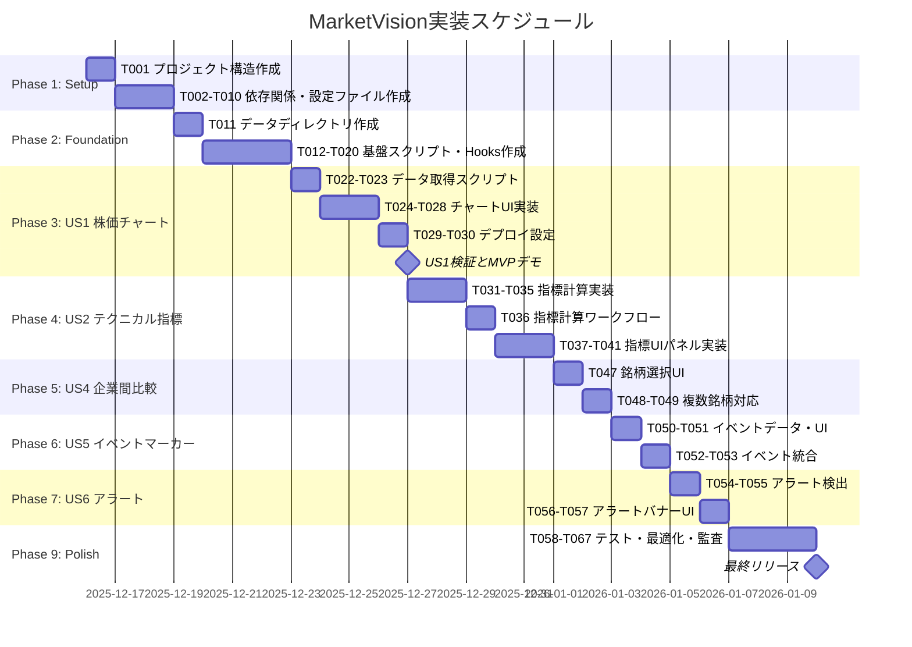

# タスクリスト: MarketVision 株価テクニカル分析ダッシュボード

**Branch**: `001-marketvision-implementation` | **Date**: 2025-12-15  
**Input**: [spec.md](https://github.com/J1921604/MarketVision/blob/main/specs/001-marketvision-implementation/spec.md), [plan.md](https://github.com/J1921604/MarketVision/blob/main/specs/001-marketvision-implementation/plan.md), [data-model.md](https://github.com/J1921604/MarketVision/blob/main/specs/001-marketvision-implementation/data-model.md)  
**Version**: 1.0.0

---

## タスク形式: `- [ ] [TaskID] [P?] [Story?] 説明（ファイルパス）`

- **[P]**: 並列実行可能（異なるファイル、依存関係なし）
- **[Story]**: 所属するユーザーストーリー（US1、US2、US3等）
- **説明には必ず正確なファイルパスを含める**

---

## パス規約

本プロジェクトはシングルプロジェクト構成を採用:
- **フロントエンド**: `src/`（React + TypeScript + Vite）
- **バックエンド**: `scripts/`（Pythonデータ処理スクリプト）
- **データストレージ**: `data/`（CSV/JSON）
- **テスト**: `tests/`（Vitest + Playwright）
- **CI/CD**: `.github/workflows/`

---

## Phase 1: セットアップ（プロジェクト初期化）

**目的**: プロジェクト構造の構築と基本ツールの設定

- [x] T001 プロジェクト構造を作成（src/、scripts/、data/、tests/、.github/workflows/）
- [x] T002 [P] package.jsonを初期化（React 18.2、TypeScript 5.3、Vite 5.0、Recharts 2.10、Tailwind CSS 3.4依存関係）
- [x] T003 [P] requirements.txtを作成（Python 3.11、pandas_datareader、pandas 2.1、numpy 1.26、pytest 7.4）
- [x] T004 [P] tsconfig.jsonを設定（strictモード、ES2022、Reactサポート）
- [x] T005 [P] vite.config.tsを設定（GitHub Pagesベースパス、コード分割、Tree Shaking有効化）
- [x] T006 [P] tailwind.config.jsを設定（Cyberpunk Neumorphismテーマ、カスタムカラー定義）
- [x] T007 [P] .gitignoreを設定（node_modules、dist、.env.local、data/.quota/除外）
- [x] T008 [P] README.mdを作成（プロジェクト概要、セットアップ手順、ライセンス情報）
- [x] T010 [P] ESLintとPrettierを設定（.eslintrc.js、.prettierrc）

**Checkpoint**: プロジェクト構造が完成し、依存関係がインストール可能な状態

---

## Phase 2: 基盤整備（全ユーザーストーリーの前提条件）

**目的**: すべてのユーザーストーリー実装前に必須となるコア機能の確立

**⚠️ 重要**: このフェーズが完了するまで、いかなるユーザーストーリーも開始できません

- [x] T011 データディレクトリ構造を作成（data/price/、data/indicators/、data/events/、data/alerts/）
- [x] T012 [P] スキーマ定義ファイルdata-schemas.jsonをdata/ディレクトリにコピー（contracts/data-schemas.jsonから）
- [x] T013 [P] Pythonユーティリティscripts/utils/logger.pyを作成（ロギング設定、INFO/ERROR/DEBUGレベル）
- [x] T016 [P] データ検証スクリプトscripts/validate_data.pyを作成（スキーマバリデーション、異常値検出）
- [x] T017 [P] React hooks useLocalStorage.tsを作成（src/hooks/useLocalStorage.ts、期間フィルタ状態永続化用）
- [x] T018 [P] TypeScript型定義src/types/market-data.tsを作成（PriceData、IndicatorData、EventData、AlertData型）
- [x] T019 [P] CSSグローバルスタイルsrc/index.cssを作成（Tailwind imports、Cyberpunk変数定義）
- [x] T020 GitHub Actions共通設定.github/workflows/common-setup.ymlを作成（Node.js 18、Python 3.11セットアップステップ）

**Checkpoint**: 基盤完成 - ユーザーストーリー実装が並行開始可能

---

## Phase 3: ユーザーストーリー1 - 株価チャート表示 (Priority: P1) 🎯 MVP

**Goal**: 東京電力HDまたは中部電力の過去5年間の株価をローソク足チャートで表示し、期間フィルタで絞り込み可能にする

**独立テスト方法**: Stooqから9501.Tデータを取得し、ローソク足チャート（OHLC）が描画され、期間フィルタ（1M/3M/6M/1Y等）で正しく絞り込まれることを確認

### 実装: ユーザーストーリー1

- [x] T022 [P] [US1] データ取得スクリプトscripts/fetch_price_data.pyを作成（9501.T、9502.Tデータを取得してdata/price/{symbol}.csvに保存）
- [x] T023 [US1] データ取得ワークフロー.github/workflows/fetch-data.ymlを作成（毎時Cron実行、エラー時Issue自動起票）
- [x] T024 [P] [US1] Rechartsカスタムローソク足シェイプsrc/components/CandlestickShape.tsxを作成（OHLC描画、緑/マゼンタ色分け）
- [x] T025 [P] [US1] チャートキャンバスコンポーネントsrc/components/ChartCanvas.tsxを作成（ComposedChartでローソク足表示、ツールチップ実装）
- [x] T026 [P] [US1] 期間フィルタコンポーネントsrc/components/PeriodFilter.tsxを作成（1M/3M/6M/1Y/3Y/5Y/Customボタン、LocalStorage永続化）
- [x] T027 [P] [US1] データ読み込みフックsrc/hooks/useMarketData.tsを作成（CSVパース、期間絞り込みロジック）
- [x] T028 [US1] メインアプリケーションsrc/App.tsxを作成（ChartCanvas + PeriodFilter統合、9501.T/9502.T切り替えUI）
- [x] T029 [US1] ビルド設定調整vite.config.tsを更新（base: '/MarketVision/'、GitHub Pagesパス対応）
- [x] T030 [US1] デプロイワークフロー.github/workflows/deploy.ymlを作成（npm run build、gh-pagesブランチへプッシュ）

**Checkpoint**: ユーザーストーリー1が完全に機能し、独立してテスト可能 - これだけでMVPとして機能

---

## Phase 4: ユーザーストーリー2 - テクニカル指標の重ね表示 (Priority: P1)

**Goal**: 株価チャートにSMA5/25/75、RSI、MACD、ボリンジャーバンドを重ね表示し、テクニカル分析による売買シグナルを提供

**独立テスト方法**: pandas/numpyで計算したSMA、RSI、MACD、ボリンジャーバンドの値をCSV保存し、Rechartsで各指標が正しく重ね表示されることを確認。計算ロジックのユニットテストも実施

### 実装: ユーザーストーリー2

- [x] T031 [P] [US2] SMA計算関数scripts/indicators/calculate_sma.pyを作成（pandas.rolling().mean()で5/25/75日移動平均計算）
- [x] T032 [P] [US2] RSI計算関数scripts/indicators/calculate_rsi.pyを作成（14日RSI、0-100範囲検証）
- [x] T033 [P] [US2] MACD計算関数scripts/indicators/calculate_macd.pyを作成（12/26/9 EMA、MACDヒストグラム）
- [x] T034 [P] [US2] ボリンジャーバンド計算関数scripts/indicators/calculate_bollinger.pyを作成（20日SMA±2σ、上限>中央>下限検証）
- [x] T035 [US2] 統合指標計算スクリプトscripts/build_indicators.pyを作成（T031-T034統合、data/indicators/{symbol}_{indicator}.csv出力）
- [x] T036 [US2] 指標計算ワークフロー.github/workflows/calculate-indicators.ymlを作成（fetch-data.yml完了後トリガー、全指標計算）
- [x] T037 [P] [US2] テクニカルパネルコンポーネントsrc/components/TechnicalPanel.tsxを作成（SMA/RSI/MACD/BBチェックボックス、ON/OFF切り替え）
- [x] T038 [P] [US2] RSIチャートコンポーネントsrc/components/RSIChart.tsxを作成（0-100範囲、30未満/70超過エリア色分け）
- [x] T039 [P] [US2] MACDチャートコンポーネントsrc/components/MACDChart.tsxを作成（MACD/Signal線、ヒストグラム、ゴールデンクロスマーキング）
- [x] T040 [US2] ChartCanvasを更新（src/components/ChartCanvas.tsx、SMA/BB線オーバーレイ、TechnicalPanel統合）
- [x] T041 [US2] useMarketDataフックを更新（src/hooks/useMarketData.ts、指標データCSV読み込みロジック追加）

**Checkpoint**: ユーザーストーリー1とユーザーストーリー2の両方が独立して機能

---

## Phase 5: ユーザーストーリー4 - 企業間比較表示 (Priority: P2)

**Goal**: 東京電力HDと中部電力の株価を同一チャート上で比較表示し、両社のパフォーマンス差を可視化

**独立テスト方法**: 9501.Tと9502.Tの両方のデータを読み込み、同一チャート上に異なる色で描画され、凡例で両銘柄が区別できることを検証

### 実装: ユーザーストーリー4

- [x] T047 [P] [US4] 銘柄選択コンポーネントsrc/components/SymbolSelector.tsxを作成（9501.T/9502.T単独選択、両方選択チェックボックス）
- [x] T048 [US4] ChartCanvasを更新（src/components/ChartCanvas.tsx、複数銘柄データ対応、凡例クリックで表示切り替え）
- [x] T049 [US4] useMarketDataフックを更新（src/hooks/useMarketData.ts、複数銘柄データ読み込みロジック、色分け管理）

**Checkpoint**: ユーザーストーリー1、2、3、4がすべて独立して機能

---

## Phase 7: ユーザーストーリー5 - イベントマーカー表示 (Priority: P3)

**Goal**: 決算発表日や権利落ち日などの重要イベントをチャート上にマーカー表示し、価格変動との関連性を分析可能にする

**独立テスト方法**: corporate_events.jsonにイベントデータを登録し、該当日付のチャート上にアイコンマーカーが表示され、ホバー時にイベント詳細がポップアップすることを検証

### 実装: ユーザーストーリー5

- [x] T050 [P] [US5] イベントデータファイルdata/events/corporate_events.jsonを作成（決算日、権利落ち日サンプルデータ）
- [x] T051 [P] [US5] イベントマーカーコンポーネントsrc/components/EventMarker.tsxを作成（📊アイコン、ツールチップでイベント詳細表示）
- [x] T052 [US5] ChartCanvasを更新（src/components/ChartCanvas.tsx、EventMarker配置ロジック、日付マッチング）
- [x] T053 [US5] useMarketDataフックを更新（src/hooks/useMarketData.ts、data/events/corporate_events.json読み込み）

**Checkpoint**: ユーザーストーリー1、2、3、4、5がすべて独立して機能

---

## Phase 8: ユーザーストーリー6 - ±5%価格変動アラート (Priority: P3)

**Goal**: 前日比±5%以上の急激な価格変動をダッシュボード上部にアラートバナーで表示し、重要な変動を見逃さないようにする

**独立テスト方法**: 過去データから前日比±5%超の日付を抽出してalerts.jsonに記録し、ダッシュボード読み込み時にアラートバナーが表示されることを確認

### 実装: ユーザーストーリー6

- [x] T054 [P] [US6] アラート検出スクリプトscripts/detect_alerts.pyを作成（前日比±5%判定、data/alerts/alerts.json出力）
- [x] T055 [US6] アラート検出ワークフロー.github/workflows/detect-alerts.ymlを作成（指標計算後トリガー、alerts.json更新）
- [x] T056 [P] [US6] アラートバナーコンポーネントsrc/components/AlertBanner.tsxを作成（⚠️アイコン、赤色バナー、×閉じるボタン、最大3件表示）
- [x] T057 [US6] App.tsxを更新（src/App.tsx、AlertBanner配置、data/alerts/alerts.json読み込み）

**Checkpoint**: すべてのユーザーストーリー（1～6）が独立して機能

---

## Phase 9: 仕上げと横断的改善

**目的**: 複数のユーザーストーリーに影響する改善と最終検証

- [ ] T058 [P] ユニットテストtests/unit/test_indicators.pyを作成（SMA/RSI/MACD/BB計算ロジック検証、pytest実行）
- [ ] T059 [P] E2Eテストtests/e2e/test_dashboard.spec.tsを作成（Playwright、ローソク足表示、期間フィルタ、指標切り替え検証）
- [ ] T060 [P] データ検証CIワークフロー.github/workflows/validate-data.ymlを作成（validate_data.py実行、異常値検出、PRコメント）
- [ ] T061 [P] Lighthouse CIワークフロー.github/workflows/lighthouse.ymlを作成（パフォーマンススコア90以上必須、LCP<2.5秒検証）
- [ ] T062 [P] ドキュメント更新README.mdを更新（スクリーンショット追加、API制限説明、トラブルシューティング）
- [ ] T063 [P] ドキュメント更新docs/CONTRIBUTING.mdを作成（ブランチ戦略、憲法遵守チェックリスト、PRテンプレート）
- [ ] T064 コードクリーンアップとリファクタリング（未使用import削除、型定義厳格化、ESLintエラー0件達成）
- [ ] T065 パフォーマンス最適化（Rechartsコンポーネント遅延読み込み、初期バンドル180KB達成）
- [ ] T066 セキュリティ監査（git-secrets実行、APIキーハードコーディングチェック、依存関係脆弱性スキャン）
- [ ] T067 quickstart.md検証（新規環境で5分セットアップ手順実行、中部電力データ取得・表示確認）

---

## 依存関係と実行順序

### フェーズ依存関係

- **Phase 1（セットアップ）**: 依存なし - すぐ開始可能
- **Phase 2（基盤整備）**: Phase 1完了後 - **全ユーザーストーリーをブロック**
- **Phase 3～8（ユーザーストーリー）**: Phase 2完了後、並行実行可能（または優先順位順P1→P2→P3）
- **Phase 9（仕上げ）**: すべての必要なユーザーストーリー完了後

### ユーザーストーリー依存関係

- **US1（株価チャート）**: Phase 2完了後すぐ開始可能 - 他ストーリー依存なし
- **US2（テクニカル指標）**: Phase 2完了後すぐ開始可能 - US1と統合するが独立してテスト可能
- **US4（企業間比較）**: Phase 2完了後すぐ開始可能 - US1と統合するが独立してテスト可能
- **US5（イベントマーカー）**: Phase 2完了後すぐ開始可能 - US1と統合するが独立してテスト可能
- **US6（アラート）**: Phase 2完了後すぐ開始可能 - 他ストーリー依存なし

### ストーリー内タスク依存関係

**US1内**:
- T022-T023（データ取得）→ T024-T028（UI実装）→ T029-T030（デプロイ）

**US2内**:
- T031-T035（指標計算）は並列実行可能
- T036（指標計算ワークフロー）→ T037-T041（UI実装）

**US4内**:
- T047（銘柄選択UI）→ T048-T049（複数銘柄対応）

**US5内**:
- T050-T051（イベントデータ・UI）は並列実行可能 → T052-T053（統合）

**US6内**:
- T054-T055（アラート検出）→ T056-T057（バナーUI）

### 並列実行の機会

- **Phase 1**: T002-T010の8タスクすべて並列実行可能
- **Phase 2**: T012-T019の8タスク並列実行可能
- **Phase 3-8**: 各ユーザーストーリーを異なるチームメンバーが並行作業可能
- **Phase 9**: T058-T063の6タスク並列実行可能

---

## 並列実行例: ユーザーストーリー1

```bash
# US1のデータ取得タスクを並列起動:
Task: "データ取得スクリプトscripts/fetch_price_data.pyを作成"

# US1のUIコンポーネントを並列起動:
Task: "Rechartsカスタムローソク足シェイプsrc/components/CandlestickShape.tsxを作成"
Task: "チャートキャンバスコンポーネントsrc/components/ChartCanvas.tsxを作成"
Task: "期間フィルタコンポーネントsrc/components/PeriodFilter.tsxを作成"
Task: "データ読み込みフックsrc/hooks/useMarketData.tsを作成"
```

---

## 実装戦略

### MVP優先（ユーザーストーリー1のみ）

1. Phase 1: セットアップ完了
2. Phase 2: 基盤整備完了（**重要 - 全ストーリーをブロック**）
3. Phase 3: ユーザーストーリー1完了
4. **停止して検証**: ユーザーストーリー1を独立してテスト
5. デプロイ/デモ準備完了

### 段階的デリバリー

1. セットアップ + 基盤整備 → 基盤完成
2. ユーザーストーリー1追加 → 独立してテスト → デプロイ/デモ（**MVP！**）
3. ユーザーストーリー2追加 → 独立してテスト → デプロイ/デモ
4. ユーザーストーリー4追加 → 独立してテスト → デプロイ/デモ
5. ユーザーストーリー5追加 → 独立してテスト → デプロイ/デモ
6. ユーザーストーリー6追加 → 独立してテスト → デプロイ/デモ
7. 各ストーリーが価値を追加し、前のストーリーを壊さない

### 並列チーム戦略

複数の開発者がいる場合:

1. チーム全体でセットアップ + 基盤整備を完了
2. 基盤完了後:
   - 開発者A: ユーザーストーリー1
   - 開発者B: ユーザーストーリー2
   - 開発者C: ユーザーストーリー4
3. ストーリーは独立して完成し、統合可能

---

## プロジェクトスケジュール（ガントチャート）

**開始日**: 2025-12-15（日）  
**想定作業日**: 平日のみ（土日祝日、年末年始休暇を除外）  
**前提**: 1人開発者、1タスク0.5日（4時間）想定



**重要な日付**:
- **2025-12-16（月）**: プロジェクト開始
- **2025-12-19（木）**: Phase 1完了予定
- **2025-12-25（水）**: Phase 2完了予定（**基盤完成**）
- **2025-12-28（土）～2026-01-05（日）**: 年末年始休暇（作業停止）
- **2026-01-06（月）**: US1開始
- **2026-01-09（木）**: US1完了、**MVPデモ可能**
- **2026-01-23（金）**: 全ユーザーストーリー完了予定
- **2026-01-29（木）**: 最終リリース予定

**スケジュール調整方法**:
上記のMermaid ganttチャートは相対日付方式を採用していますが、自動再計算されません。開始日を変更する場合は、以下の手順で手動更新してください:

1. `dateFormat YYYY-MM-DD`の下の各タスクの日付を新しい開始日から計算
2. 土日祝日（2025-12-21/22、2025-12-28/29、2026-01-01～05等）をスキップ
3. `after`キーワードを使用した相対指定は維持（例: `after t001`）

---

## 注意事項

- **[P]タスク** = 異なるファイル、依存関係なし、並列実行可能
- **[Story]ラベル** = 特定のユーザーストーリーへのタスクのトレーサビリティ
- 各ユーザーストーリーは独立して完成・テスト可能であること
- 実装前にテストが失敗することを確認すること（TDD原則）
- 各タスクまたは論理グループ後にコミットすること
- 各チェックポイントでストーリーを独立して検証すること
- **避けるべき事項**: 曖昧なタスク、同一ファイル競合、ストーリー独立性を壊す横断依存

---

**Version**: 1.0.0  
**Last Updated**: 2025-12-15  
**Repository**: https://github.com/J1921604/MarketVision
