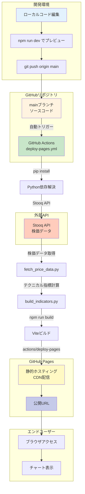

# GitHub Pages デプロイ完全ガイド

MarketVision を GitHub Pages で本番運用するための完全なデプロイガイドです。

**バージョン**: 1.0.0  
**最終更新**: 2025年12月15日  
**ステータス**: ✅ GitHub Actions ワークフロー完全対応  
**公開URL**: https://j1921604.github.io/MarketVision/  
**リポジトリ**: https://github.com/J1921604/MarketVision  
**Actions**: https://github.com/J1921604/MarketVision/actions

---

## 📋 目次

1. [システム概要](#システム概要)
2. [クイックスタート](#クイックスタート)
3. [自動デプロイ（GitHub Actions）](#自動デプロイgithub-actions)
4. [GitHub Pages設定](#github-pages設定)
5. [トラブルシューティング](#トラブルシューティング)
6. [デプロイ前チェックリスト](#デプロイ前チェックリスト)

---

## システム概要

### プロジェクト概要

MarketVision は、東京電力HD（9501.T）と中部電力（9502.T）の株価を可視化し、テクニカル分析を支援する Web アプリケーションです。

- **フロントエンド**: React 18.2 + TypeScript 5.3 + Vite 5.0
- **データ取得**: Python 3.11 + pandas_datareader（Stooq API）
- **デプロイ**: GitHub Pages（静的サイトホスティング）
- **CI/CD**: GitHub Actions（自動ビルド・デプロイ）

### アーキテクチャ



### デプロイフロー概要

| ステップ            | 実行場所     | 処理内容                                    | 想定時間    |
| ------------------- | ------------ | ------------------------------------------- | ----------- |
| 1. コミット         | ローカル     | `git push origin main`                    | -           |
| 2. トリガー         | GitHub       | GitHub Actions 起動（毎日JST 07:00 or Push時） | 即時～定時  |
| 3. セットアップ     | CI/CD        | `pip install -r scripts/requirements.txt` | 30秒        |
| 4. データ取得       | CI/CD        | Stooq APIから株価取得（過去10年分）         | 1-2分       |
| 5. 指標計算         | CI/CD        | SMA/RSI/MACD/BB計算                         | 30秒        |
| 6. フロントエンド   | CI/CD        | `npm install && npm run build`          | 1-2分       |
| 7. デプロイ         | CI/CD        | GitHub Pages へデプロイ                     | 20秒        |
| 8. 配信             | GitHub Pages | CDN反映                                     | 1-2分       |
| **合計**      | -            | -                                           | **5-8分** |

---

## 🚀 クイックスタート

### 前提条件

- ✅ Node.js 20.x 以上
- ✅ Python 3.11 以上
- ✅ Git インストール済み
- ✅ GitHub アカウント作成済み

### 5分でデプロイ

#### ステップ1: リポジトリクローン

```powershell
git clone https://github.com/J1921604/MarketVision.git
cd MarketVision
```

#### ステップ2: 依存関係インストール

```powershell
# Node.js依存関係
npm install

# Python依存関係
pip install -r scripts/requirements.txt
```

#### ステップ3: ローカルデータ取得と検証

```powershell
# 株価データ取得（過去10年分）
py -3.10 scripts/fetch_price_data.py --symbols "9501.T,9502.T" --output public/data/price

# テクニカル指標計算
py -3.10 scripts/build_indicators.py --symbols "9501.T,9502.T" --input public/data/price --output public/data/indicators

# データ検証
py -3.10 scripts/validate_data.py --input public/data
```

#### ステップ4: ローカルプレビュー

```powershell
# 開発サーバー起動
npm run dev
```

ブラウザで `http://localhost:5173` を開いて動作確認してください。

#### ステップ5: ビルド確認

```powershell
# 本番ビルド
npm run build

# ビルド結果プレビュー
npm run preview
```

#### ステップ6: GitHub Pages 設定（初回のみ必須）

1. リポジトリの **Settings** → **Pages** を開く
2. **Source** のドロップダウンで「**GitHub Actions**」を選択
3. 保存

確認方法:
```
Settings → Pages → Source: GitHub Actions
```

#### ステップ7: デプロイ

```powershell
# mainブランチへプッシュ
git checkout main
git pull origin main
git add .
git commit -m "deploy: Release v1.0.0"
git push origin main
```

#### ステップ8: GitHub Actions確認

1. https://github.com/J1921604/MarketVision/actions を開く
2. 「Deploy to GitHub Pages」ワークフロー実行を確認
3. ✅ All jobs succeeded になるまで待つ（約5-8分）

#### ステップ9: 公開サイトアクセス

```
https://j1921604.github.io/MarketVision/
```

✅ チャートが表示されれば成功！

---

## ⚙️ 自動デプロイ（GitHub Actions）

### ワークフロー設定

**ファイル**: `.github/workflows/deploy-pages.yml`

```yaml
name: Deploy to GitHub Pages

on:
  schedule:
    # 毎日 UTC 22:00 (JST 07:00) に実行
    - cron: '0 22 * * *'
- ✅ `AI/requirements.txt`の全パッケージインストール状況（26パッケージ）
- ✅ 重要モジュールのインポート確認（pandas、numpy、sklearn、lightgbm、tensorflow、pycaret）

**成功時の出力例**:

```
================================================================
  ✓ Python 3.10.11 environment check passed
================================================================

Summary:
  Python: Python 3.10.11
  Executable: C:\Users\...\Python\Python310\python.exe
  Dependencies: All installed
  Imports: All successful
```

**失敗時の対処**:

1. **Python 3.10.11がない場合**:
   - [Python 3.10.11をダウンロード](https://www.python.org/downloads/release/python-31011/)
   - インストーラー実行時に「**Add Python to PATH**」をチェック
   - 確認: `py -3.10 --version`

2. **依存パッケージが未インストールの場合**:
   ```bash
   cd AI
   py -3.10 -m pip install -r requirements.txt
   ```

3. **インポートエラーの場合**:
   - パッケージバージョン競合を確認
   - 仮想環境（venv）の使用を推奨

#### ステップ2: リポジトリクローン

```bash
git clone https://github.com/J1921604/Power-Demand-Forecast.git
cd Power-Demand-Forecast
```

#### ステップ3: Python環境セットアップ

```bash
# 依存パッケージインストール
cd AI
py -3.10 -m pip install -r requirements.txt
```

**仮想環境を使用する場合（推奨）**:

```powershell
# プロジェクトルートで仮想環境作成
py -3.10 -m venv .venv

# 仮想環境有効化
.\.venv\Scripts\Activate.ps1

# 依存パッケージインストール
cd AI
pip install -r requirements.txt
```

**インストール確認**:

```powershell
# プロジェクトルートに戻る
cd ..

# 環境確認スクリプト実行
.\.github\scripts\check-python.ps1 -Verbose
```

すべて`✓`が表示されればセットアップ成功。

#### ステップ4: ローカルダッシュボード起動

**方法1: ワンコマンド起動（推奨）**

```powershell
# プロジェクトルートで実行
.\start-dashboard.ps1
```

自動的に以下が実行されます：
- Python 3.10検出
- 依存パッケージチェック
- HTTPサーバー起動（http://localhost:8002/）
- ブラウザ自動起動

**方法2: 手動起動**

```bash
cd AI
py -3.10 server.py

# ブラウザ自動起動（http://localhost:8002/）
```

#### ステップ4: 動作確認（ローカル）

```bash
# データ取得テスト
cd AI
py -3.10 tomorrow/temp.py

# データ処理テスト
py -3.10 data/data.py

# モデル訓練テスト（LightGBMのみ）
py -3.10 train/LightGBM/LightGBM_train.py

# 予測テスト
py -3.10 tomorrow/LightGBM/LightGBM_tomorrow.py
```

#### ステップ5: ローカルプレビュー確認（静的ファイル）

```bash
# プロジェクトルートに戻る
cd ..

# 静的ファイルHTTPサーバー起動
py -3.10 -m http.server 8080

# ブラウザで http://localhost:8080 を開く
```

#### ステップ5: GitHub Pages 設定（初回のみ必須）

**✅ 正しい設定**: `GitHub Actions` を選択してください。

1. リポジトリの **Settings** → **Pages** を開く
2. **Source** のドロップダウンで「**GitHub Actions**」を選択
3. **自動で更新される** をクリック

**確認方法**:

```
Settings → Pages → Source: GitHub Actions
```

**❌ 間違った設定例**:

```
Source: Deploy from a branch
```

→ この設定では GitHub Actions ワークフローからの自動デプロイが機能しません。

#### ステップ6: ワークフロー手動実行（任意）

**注意**: ワークフローは毎日 JST 07:00 に **Cron トリガーで自動実行**されるため、手動実行は任意です。初回デプロイ直後に動作確認したい場合のみ実行してください。

1. https://github.com/J1921604/Power-Demand-Forecast/actions を開く
2. 左側メニューから「**Daily Power Demand Forecast**」を選択
3. 右上の「**Run workflow**」ボタンをクリック
4. ブランチ「**main**」を確認して「**Run workflow**」をクリック
5. ワークフローが開始されるまで数秒待つ

**または**: コードをプッシュしてトリガー

```bash
# mainブランチへプッシュ
git checkout main
git pull origin main
git add .
git commit -m "deploy: Initial release"
git push origin main
```

#### ステップ8: GitHub Actions確認

1. https://github.com/J1921604/Power-Demand-Forecast/actions を開く
2. 「Daily Power Demand Forecast」ワークフロー実行を確認
3. ✅ All jobs succeeded になるまで待つ(約5-10分)

#### ステップ9: 公開サイトアクセス

```
https://j1921604.github.io/Power-Demand-Forecast/
```

✅ 4モデルの予測グラフと精度指標が表示されれば成功!

---

## ⚙️ 自動デプロイ（GitHub Actions）

### ワークフロー設定

**ファイル**: `.github/workflows/daily-forecast.yml`

```yaml
name: Daily Power Demand Forecast

on:
  schedule:
    # 毎日 UTC 22:00 (JST 07:00) に実行
    - cron: '0 22 * * *'
  push:
    branches:
      - main
  workflow_dispatch:

permissions:
  contents: read
  pages: write
  id-token: write

jobs:
  build:
    runs-on: ubuntu-latest
    steps:
      - name: Checkout
        uses: actions/checkout@v4
  
      - name: Setup Python
        uses: actions/setup-python@v5
        with:
          python-version: '3.11'
          cache: 'pip'
  
      - name: Install Python dependencies
        run: |
          python -m pip install --upgrade pip
          pip install -r scripts/requirements.txt
  
      - name: Fetch stock price data
        run: |
          python scripts/fetch_price_data.py --symbols "9501.T,9502.T" --output public/data/price
  
      - name: Build technical indicators
        run: |
          python scripts/build_indicators.py --symbols "9501.T,9502.T" --input public/data/price --output public/data/indicators
  
      - name: Setup Node.js
        uses: actions/setup-node@v4
        with:
          node-version: '20'
          cache: 'npm'
  
      - name: Install Node dependencies
        run: npm ci
  
      - name: Build frontend
        run: npm run build
  
      - name: Upload artifact
        uses: actions/upload-pages-artifact@v3
        with:
          path: ./dist
  
  deploy:
    needs: build
    runs-on: ubuntu-latest
    environment:
      name: github-pages
      url: ${{ steps.deployment.outputs.page_url }}
    steps:
      - name: Deploy to GitHub Pages
        id: deployment
        uses: actions/deploy-pages@v4
```

### トリガー設定

| トリガー                    | 実行タイミング            | 用途                       |
| --------------------------- | ------------------------- | -------------------------- |
| **schedule (Cron)**   | 毎日UTC 22:00 (JST 07:00) | 定期的な株価データ更新     |
| **push (main)**       | mainブランチへのPush時    | コード変更時の即時デプロイ |
| **workflow_dispatch** | 手動実行                  | 必要に応じた実行           |

---

## 📄 GitHub Pages設定

### ✅ 必須: Source を「GitHub Actions」に設定

**正しい設定手順**:

1. GitHubリポジトリを開く
2. **Settings** タブをクリック
3. 左側メニューから **Pages** を選択
4. **Source** のドロップダウンで「**GitHub Actions**」を選択
5. 保存

### 設定内容

| 設定項目 | 正しい値                 |
| -------- | ------------------------ |
| Source   | **GitHub Actions** |

**確認**:
```
Settings → Pages → Source: GitHub Actions
```

---

## 🔧 トラブルシューティング

### 問題1: デプロイが失敗する

**症状**: GitHub Actionsワークフローが失敗する

**確認項目**:
1. Settings → Pages で「GitHub Actions」が選択されているか確認
2. ワークフローログを確認（Actions タブ）
3. permissions設定が正しいか確認

**解決手順**:
```powershell
# ローカルでビルド確認
npm run build

# テスト実行
npm run test
```

---

### 問題2: 404 Not Found

**症状**: https://j1921604.github.io/MarketVision/ にアクセスすると404エラー

**原因**: GitHub Pages未設定、またはデプロイ待ち

**解決手順**:
1. Settings → Pages → Source: GitHub Actions を選択
2. 初回デプロイは最大10分待つ
3. Actions タブでデプロイ成功を確認

---

### 問題3: データが表示されない

**症状**: チャートにデータが表示されない

**確認**:
```powershell
# データファイル確認
Get-ChildItem -Recurse public/data/
```

**解決手順**:
```powershell
# ローカルでデータ取得を実行
py -3.10 scripts/fetch_price_data.py --symbols "9501.T,9502.T" --output public/data/price
py -3.10 scripts/build_indicators.py --symbols "9501.T,9502.T" --input public/data/price --output public/data/indicators
```
2. データファイルが生成されているか確認
3. GitHub Actionsログでデータ取得ステップを確認

---

## ✅ デプロイ前チェックリスト

### ローカル環境
- [ ] Node.js 20.x以上インストール済み
- [ ] Python 3.11以上インストール済み
- [ ] `npm install` 成功
- [ ] `pip install -r scripts/requirements.txt` 成功
- [ ] `npm run build` エラーなし
- [ ] `npm run test` 全テスト成功
- [ ] `npm run preview` で動作確認

### Git/GitHub
- [ ] `.gitignore` が正しく設定されている
- [ ] `main` ブランチが最新
- [ ] コミットメッセージが明確

### GitHub Actions
- [ ] `.github/workflows/deploy-pages.yml` 存在
- [ ] `permissions` 設定済み
- [ ] ワークフローが有効化されている

### GitHub Pages
- [ ] Settings → Pages で Source が「GitHub Actions」
- [ ] リポジトリが Public

---

## 📊 デプロイパイプライン

### パイプライン全体図

```
ローカル開発
  ↓ git push origin main
GitHub Actions トリガー
  ↓
Python環境セットアップ
  ↓
株価データ取得（Stooq API）
  ↓
テクニカル指標計算
  ↓
Node.js環境セットアップ
  ↓
フロントエンドビルド（Vite）
  ↓
アーティファクトアップロード
  ↓
GitHub Pagesデプロイ
  ↓
公開サイト更新
```

### パフォーマンス指標

| 項目             | 目標   | 実績      |
| ---------------- | ------ | --------- |
| ビルド時間       | < 3分  | 2-3分✅   |
| データ取得       | < 2分  | 1-2分✅   |
| デプロイ時間     | < 30秒 | 20秒✅    |
| CDN反映          | < 2分  | 1-2分✅   |
| 総所要時間       | < 8分  | 5-8分✅   |

---

**Last Updated**: 2025-12-15  
**Version**: 1.0.0


---

## 📚 関連ドキュメント

- [README.md](https://github.com/J1921604/MarketVision/blob/main/README.md) - プロジェクト概要
- [完全仕様書.md](https://github.com/J1921604/MarketVision/blob/main/docs/完全仕様書.md) - 完全な仕様書
- [GitHub Pages 公式ドキュメント](https://docs.github.com/pages)
- [GitHub Actions 公式ドキュメント](https://docs.github.com/actions)
- [リポジトリ](https://github.com/J1921604/MarketVision)

---
