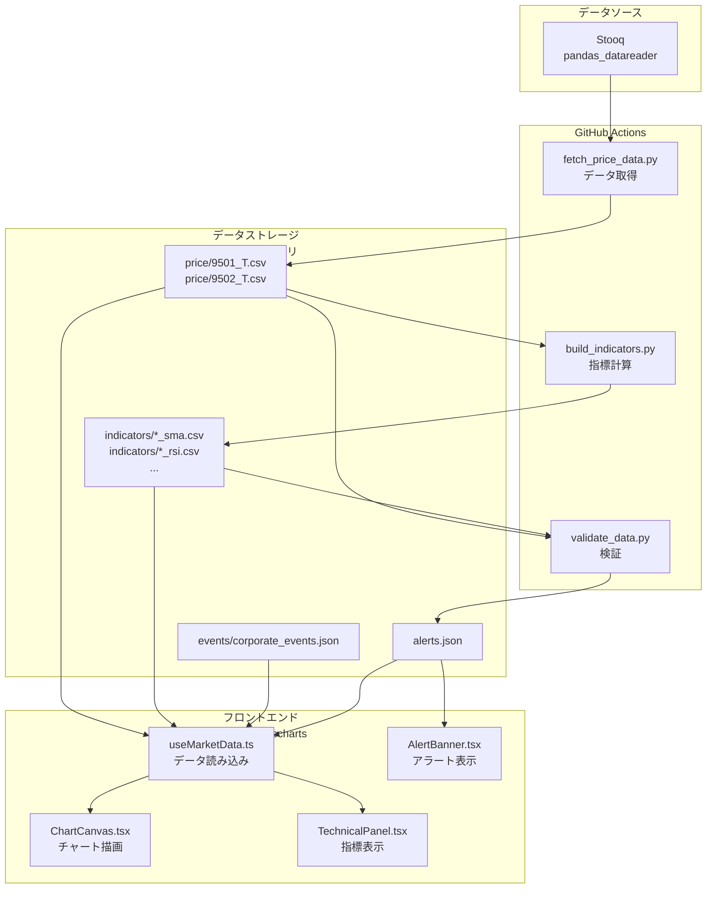

# 機能仕様書: MarketVision 株価テクニカル分析ダッシュボード

**Feature Branch**: `001-MarketVision`  
**Created**: 2025-11-29  
**Status**: Draft  
**Version**: 1.0.0  
**Input**: MarketVision株価テクニカル分析ダッシュボードの実装

## プロジェクト概要

東京電力HD（9501.T）・中部電力（9502.T）の株価データをテクニカル指標・イベントマーカーで分析するインタラクティブな価格分析環境をGitHub Pages上で提供します。

### 目的

- テクニカル指標による多角的な価格分析を実現
- 決算・配当等の重要イベントとの関連性を可視化
- 無料APIの制限内で継続的なデータ更新を自動化

---

## ユーザーシナリオとテスト

### ユーザーストーリー1 - 株価チャート表示 (Priority: P1)

**ストーリー**:
投資家として、東京電力HDまたは中部電力の過去10年間の株価推移をローソク足チャートで確認し、価格変動のトレンドを把握したい。

**優先順位の理由**:
株価データの可視化は本プロジェクトの最も基本的な価値提供であり、これなしでは他のすべての機能が成立しない。単独でMVP（最小限の実行可能製品）として機能する。

**独立テスト方法**:
Stooq (pandas_datareader) から9501.Tまたは9502.Tのデータを取得し、ローソク足チャート（OHLC）として描画されることを確認。期間フィルタ（1M/3M/6M/1Y等）を切り替えて、データが正しく絞り込まれることを検証。

**受入シナリオ**:

1. **Given** ダッシュボードにアクセスした状態で、**When** 「9501.T（東京電力HD）」を選択し、**Then** 過去10年間の日次ローソク足チャートが表示される
2. **Given** チャートが表示された状態で、**When** 期間フィルタ「1Y（1年間）」を選択し、**Then** 直近1年間のデータのみが再描画される
3. **Given** チャートが表示された状態で、**When** ローソク足にカーソルを合わせると、**Then** その日の日付・始値・高値・安値・終値・出来高がツールチップで表示される

---

### ユーザーストーリー2 - テクニカル指標の重ね表示 (Priority: P1)

**ストーリー**:
投資家として、株価チャートに移動平均線（SMA5/25/50/75）、RSI、MACD、ボリンジャーバンドを重ね表示し、テクニカル分析による売買シグナルを把握したい。

**優先順位の理由**:
テクニカル指標は株価の単純な推移以上の洞察を提供し、投資判断の精度を大きく向上させる。チャート表示単体（US1）と組み合わせることで、実用的な分析ツールとして成立する。

**独立テスト方法**:
株価データに対して、pandas/numpyで計算したSMA、RSI、MACD、ボリンジャーバンドの値をCSV形式で保存し、Rechartsで各指標が正しく重ね表示されることを確認。計算ロジックのユニットテストも実施。

**受入シナリオ**:

1. **Given** 株価チャートが表示された状態で、**When** 「SMA5」チェックボックスをONにすると、**Then** 5日移動平均線が緑色でオーバーレイ表示される
2. **Given** テクニカルパネルで「RSI」を選択した状態で、**When** RSI値が30未満（売られすぎ）または70超過（買われすぎ）になると、**Then** 該当エリアが色分けされて表示される
3. **Given** MACDパネルが表示された状態で、**When** MACDラインがシグナルラインを上抜けすると、**Then** 「ゴールデンクロス」として視覚的にマーキングされる

---

### ユーザーストーリー3 - 企業間比較表示 (Priority: P2)

**ストーリー**:
投資家として、東京電力HDと中部電力の株価を同一チャート上で比較表示し、両社のパフォーマンス差を把握したい。

**優先順位の理由**:
業種比較は投資判断に有用だが、単一企業の分析だけでも基本的な価値は提供できるため、P2とする。

**独立テスト方法**:
9501.Tと9502.Tの両方のデータを読み込み、同一チャート上に異なる色で描画されることを確認。凡例で両銘柄が区別できることを検証。

**受入シナリオ**:

1. **Given** 9501.T（東京電力HD）のチャートが表示された状態で、**When** 「9502.T（中部電力）を追加」ボタンをクリックすると、**Then** 両社の株価が異なる色で同一チャート上に表示される
2. **Given** 両銘柄が表示された状態で、**When** 凡例の「9501.T」をクリックすると、**Then** 東京電力HDの線のみが一時的に非表示になる
3. **Given** 比較表示中に、**When** 期間フィルタを変更すると、**Then** 両銘柄とも同じ期間でデータが再描画される

---

### ユーザーストーリー4 - イベントマーカー表示 (Priority: P3)

**ストーリー**:
投資家として、決算発表日や権利落ち日などの重要イベントをチャート上にマーカーとして表示し、価格変動との関連性を分析したい。

**優先順位の理由**:
イベント情報は分析の質を高めるが、株価とテクニカル指標だけでも十分な価値を提供できるため、P3とする。

**独立テスト方法**:
`corporate_events.json`ファイルにイベントデータを登録し、該当日付のチャート上にアイコンマーカーが表示されることを確認。マーカーホバー時にイベント詳細がポップアップすることを検証。

**受入シナリオ**:

1. **Given** 株価チャートが表示された状態で、**When** 決算発表日がある場合、**Then** その日付の上部に📊アイコンが表示される
2. **Given** イベントマーカーが表示された状態で、**When** マーカーにカーソルを合わせると、**Then** 「Q2決算発表」などのイベント詳細がツールチップで表示される
3. **Given** 権利落ち日マーカーが表示された状態で、**When** その日の株価が大きく下落している場合、**Then** マーカーとローソク足が視覚的に関連付けられる（色の統一等）

---

### ユーザーストーリー5 - ±5%価格変動アラート (Priority: P3)

**ストーリー**:
投資家として、前日比±5%以上の急激な価格変動があった場合、ダッシュボード上部にアラートバナーが表示され、重要な変動を見逃さないようにしたい。

**優先順位の理由**:
アラート機能は便利だが、チャートを目視確認すれば同等の情報は得られるため、P3とする。

**独立テスト方法**:
過去データから前日比±5%を超える日付を抽出し、`alerts.json`に記録。ダッシュボード読み込み時にアラートバナーが表示されることを確認。

**受入シナリオ**:

1. **Given** 最新データで前日比-5.2%の下落があった場合、**When** ダッシュボードにアクセスすると、**Then** 「⚠️ 9501.T：前日比-5.2%の急落」というバナーが赤色で表示される
2. **Given** アラートバナーが表示された状態で、**When** バナーの「×」ボタンをクリックすると、**Then** バナーが閉じられる
3. **Given** アラートが複数ある場合、**When** ダッシュボードにアクセスすると、**Then** 最新のアラートから順に最大3件までバナー表示される

---

### エッジケース

- **データ取得エラー時**: Stooqからのデータ取得に失敗した場合、最大3回リトライし、それでも失敗する場合はGitHub Issueで自動通知を発行する
- **データ欠損時**: レスポンスが不完全な場合、`validate_data.py`でエラー検出し、前回の正常データを維持する
- **祝日・休場日**: 株式市場が休場の日は、前営業日のデータを表示し続ける（最新データとして誤解を招かないよう日付を明示）
- **株価データの欠損**: 特定の日付（休市日等）にデータが無い場合、チャートのその部分で線が途切れる
- **異常値検出**: 株価が0円以下、または前日比500%以上の変動がある場合、データ異常としてアラートを発し、該当データをチャートから除外する

---

## 要件

### 機能要件

- **FR-001**: システムは東京電力HD（9501.T）と中部電力（9502.T）の過去10年間の日次株価データ（OHLCV）を表示しなければならない
- **FR-002**: システムはStooq (pandas_datareader) を使用してデータを取得し、データアクセス方針（リトライ制限等）を遵守しなければならない
- **FR-003**: システムは取得したデータをCSV形式（`data/price/{symbol}.csv`）で保存し、GitHub Actionsによる定期更新（毎時実行）を行わなければならない
- **FR-004**: システムは移動平均線（SMA5/25/50/75）、RSI（14日）、MACD（12/26/9）、ボリンジャーバンド（20日/±2σ）をpandas/numpyで計算し、CSV形式で保存しなければならない
- **FR-005**: ユーザーは期間フィルタ（1M/3M/6M/1Y/3Y/5Y/Custom）を選択し、指定期間のデータのみを表示できなければならない
- **FR-006**: ユーザーはテクニカル指標のON/OFF切り替えをチェックボックスで操作し、リアルタイムにチャート表示を更新できなければならない
- **FR-007**: システムは決算日・権利落ち日等のイベント情報を`data/events/corporate_events.json`から読み込み、チャート上にマーカー表示しなければならない
- **FR-008**: システムは前日比±5%以上の価格変動を検出し、`data/alerts.json`に記録してダッシュボード上部にバナー表示しなければならない
- **FR-009**: システムはGitHub Pagesにビルド成果物をデプロイし、静的Webサイトとして公開しなければならない
- **FR-010**: システムはデータ更新失敗時、GitHub Issueを自動起票し、ラベル「data-failure」を付与しなければならない
- **FR-011**: システムはすべてのCSV/JSONデータにスキーマバージョン情報を含め、`validate_data.py`でスキーマ検証を実行しなければならない
- **FR-012**: システムはパフォーマンス基準（LCP < 2.5秒、TTI < 2.0秒、初期ロード < 500KB、チャート再描画 < 200ms）を満たさなければならない

### 主要エンティティ

- **株価データ**: 日付、始値、高値、安値、終値、出来高を含むOHLCVデータ。銘柄ごとにCSVファイルで管理
- **テクニカル指標データ**: 各指標（SMA、RSI、MACD、ボリンジャーバンド）を銘柄ごとに別CSVで保存
- **イベントデータ**: 日付、銘柄、イベント種別（earnings/ex-dividend/etc）、ラベルを含むJSON配列
- **アラートデータ**: タイムスタンプ、銘柄、変動率、トリガー条件、終値を含むJSON配列

---

## 成功基準

### 測定可能な成果

- **SC-001**: ユーザーはダッシュボードアクセスから2.5秒以内に最初の株価チャートを閲覧できる（LCP基準）
- **SC-002**: ユーザーは期間フィルタ切り替え操作から200ミリ秒以内にチャートが再描画される
- **SC-003**: システムは10年分の日次データ（約2500レコード/銘柄）を500KB以下の初期ロードサイズで提供できる
- **SC-004**: システムはデータプロバイダーの制限内で2銘柄の株価データを更新できる
- **SC-005**: データ更新ワークフローは95%以上の成功率を維持できる（月間30日中28日以上成功）
- **SC-006**: ユーザーはテクニカル指標（SMA/RSI/MACD/BB）の切り替えを5回実施しても、チャート応答性が維持される（再描画 < 200ms）
- **SC-007**: システムは前日比±5%以上の急激な変動を100%の確率で検出し、アラートバナーに表示できる
- **SC-008**: ユーザーは90%以上の確率で、初回アクセス時に最新データ（24時間以内に更新されたもの）を閲覧できる
- **SC-009**: システムはLighthouse パフォーマンススコア90以上を維持できる
- **SC-010**: データ異常値（株価0円以下、前日比500%超）は100%の確率で検出され、チャートから除外される

---

## 前提条件

- データ更新はGitHub Actionsで自動実行されるため、ローカル環境での手動実行は不要（開発時を除く）
- 株式市場の休場日（土日祝日）はデータ更新をスキップするが、エラーとしては扱わない

---

## システムアーキテクチャ

### データフロー図

---

## ブランチ戦略

本機能の実装は憲法で定められたブランチ戦略に従います:

```mermaid
flowchart TB
    M1[main] --> S1[001-MarketVision<br/>仕様ブランチ]
    S1 --> I1[feature/impl-001-data-fetch<br/>データ取得]
    S1 --> I2[feature/impl-001-indicators<br/>テクニカル指標計算]
    S1 --> I3[feature/impl-001-frontend<br/>Reactダッシュボード]
    S1 --> I4[feature/impl-001-cicd<br/>CI/CD設定]
    
    I1 -->|PR| S1
    I2 -->|PR| S1
    I3 -->|PR| S1
    I4 -->|PR| S1
    S1 -->|最終PR| M1
    
    style S1 fill:#00FF84
    style M1 fill:#00D4FF
    style I1 fill:#0D1414
    style I2 fill:#0D1414
    style I3 fill:#0D1414
    style I4 fill:#0D1414
```

---

## 関連ドキュメント

- **[プロジェクト憲法](https://github.com/J1921604/MarketVision/blob/main/.specify/memory/constitution.md)**: 開発原則とガバナンス
- **[実装計画書](https://github.com/J1921604/MarketVision/blob/main/specs/feature/impl-001-MarketVision/plan.md)**: 技術選定、アーキテクチャ設計
- **[タスクリスト](https://github.com/J1921604/MarketVision/blob/main/specs/feature/impl-001-MarketVision/tasks.md)**: 実装タスク一覧、ガントチャート
- **[要件チェックリスト](https://github.com/J1921604/MarketVision/blob/main/specs/feature/impl-001-MarketVision/checklists/requirements.md)**: 仕様品質検証
- **[README](https://github.com/J1921604/MarketVision/blob/main/README.md)**: プロジェクト概要

---

**Version**: 1.0.0  
**Last Updated**: 2025-12-15  
**Repository**: https://github.com/J1921604/MarketVision
