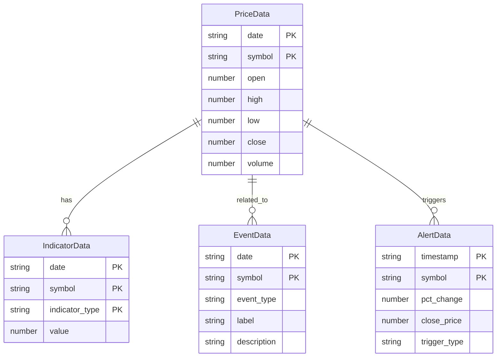
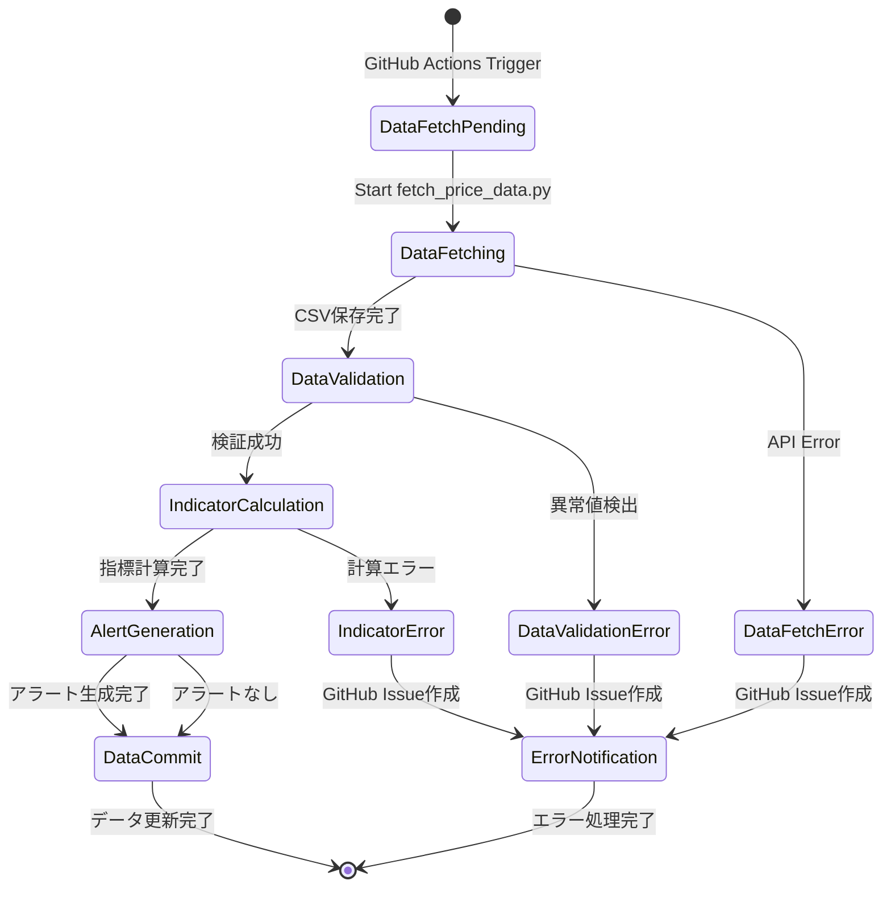

# Data Model: MarketVision 株価テクニカル分析ダッシュボード

**Branch**: `feature/impl-001-MarketVision`  
**Date**: 2025-12-15  
**Phase**: 1 - 設計・契約

## 概要

本ドキュメントは、MarketVisionプロジェクトで使用するデータモデル、エンティティの関係、検証ルール、状態遷移を定義します。

---

## エンティティ定義

### 1. PriceData（株価データ）

**説明**: 東京電力HD（9501.T）・中部電力（9502.T）の日次株価データ（OHLCV形式）

**フィールド**:

| フィールド | 型 | 必須 | 説明 | 検証ルール |
|-----------|-----|------|------|-----------|
| `date` | `string` | ✅ | 日付（ISO 8601形式: `YYYY-MM-DD`） | 有効な日付、未来日NG |
| `open` | `number` | ✅ | 始値（円） | ≥ 0、前日比±50%以内 |
| `high` | `number` | ✅ | 高値（円） | ≥ open、≥ low、≥ close |
| `low` | `number` | ✅ | 安値（円） | ≤ open、≤ high、≤ close、≥ 0 |
| `close` | `number` | ✅ | 終値（円） | ≥ 0、前日比±50%以内 |
| `volume` | `number` | ✅ | 出来高（株） | ≥ 0、整数 |
| `symbol` | `string` | ✅ | 銘柄コード | `9501.T` または `9502.T` |

**CSV例**:

```csv
date,open,high,low,close,volume,symbol
2024-11-29,450.5,455.0,448.0,452.0,12500000,9501.T
2024-11-28,448.0,451.0,445.5,450.5,11800000,9501.T
```

**検証ロジック**:

```python
def validate_price_data(df):
    # 必須フィールド確認
    required = ['date', 'open', 'high', 'low', 'close', 'volume', 'symbol']
    assert all(col in df.columns for col in required)
    
    # 高値・安値の整合性
    assert (df['high'] >= df['open']).all()
    assert (df['high'] >= df['low']).all()
    assert (df['high'] >= df['close']).all()
    assert (df['low'] <= df['open']).all()
    assert (df['low'] <= df['close']).all()
    
    # 価格が0以上
    assert (df['open'] >= 0).all()
    assert (df['high'] >= 0).all()
    assert (df['low'] >= 0).all()
    assert (df['close'] >= 0).all()
    assert (df['volume'] >= 0).all()
    
    # 前日比±50%以内
    df['pct_change'] = df['close'].pct_change()
    assert (df['pct_change'].abs() <= 0.5).all()
```

---

### 2. IndicatorData（テクニカル指標データ）

**説明**: SMA、RSI、MACD、ボリンジャーバンドの計算結果

#### 2.1. SMA（移動平均線）

| フィールド | 型 | 必須 | 説明 | 検証ルール |
|-----------|-----|------|------|-----------|
| `date` | `string` | ✅ | 日付 | PriceDataと一致 |
| `sma_5` | `number` | ❌ | 5日移動平均 | ≥ 0、null許容（最初の4日間） |
| `sma_25` | `number` | ❌ | 25日移動平均 | ≥ 0、null許容（最初の24日間） |
| `sma_75` | `number` | ❌ | 75日移動平均 | ≥ 0、null許容（最初の74日間） |
| `symbol` | `string` | ✅ | 銘柄コード | `9501.T` または `9502.T` |

**CSV例**:

```csv
date,sma_5,sma_25,sma_75,symbol
2024-11-29,452.0,450.2,445.8,9501.T
2024-11-28,450.5,449.8,445.5,9501.T
```

#### 2.2. RSI（相対力指数）

| フィールド | 型 | 必須 | 説明 | 検証ルール |
|-----------|-----|------|------|-----------|
| `date` | `string` | ✅ | 日付 | PriceDataと一致 |
| `rsi` | `number` | ❌ | RSI（14日） | 0～100、null許容（最初の14日間） |
| `symbol` | `string` | ✅ | 銘柄コード | `9501.T` または `9502.T` |

**CSV例**:

```csv
date,rsi,symbol
2024-11-29,65.5,9501.T
2024-11-28,62.3,9501.T
```

#### 2.3. MACD（移動平均収束拡散法）

| フィールド | 型 | 必須 | 説明 | 検証ルール |
|-----------|-----|------|------|-----------|
| `date` | `string` | ✅ | 日付 | PriceDataと一致 |
| `macd` | `number` | ❌ | MACDライン | null許容（最初の26日間） |
| `macd_signal` | `number` | ❌ | シグナルライン | null許容（最初の34日間） |
| `macd_hist` | `number` | ❌ | ヒストグラム | null許容（最初の34日間） |
| `symbol` | `string` | ✅ | 銘柄コード | `9501.T` または `9502.T` |

**CSV例**:

```csv
date,macd,macd_signal,macd_hist,symbol
2024-11-29,2.5,1.8,0.7,9501.T
2024-11-28,2.3,1.7,0.6,9501.T
```

#### 2.4. ボリンジャーバンド

| フィールド | 型 | 必須 | 説明 | 検証ルール |
|-----------|-----|------|------|-----------|
| `date` | `string` | ✅ | 日付 | PriceDataと一致 |
| `bb_upper` | `number` | ❌ | 上限バンド（+2σ） | ≥ bb_middle、null許容（最初の19日間） |
| `bb_middle` | `number` | ❌ | 中央線（SMA20） | ≥ 0、null許容（最初の19日間） |
| `bb_lower` | `number` | ❌ | 下限バンド（-2σ） | ≤ bb_middle、≥ 0、null許容（最初の19日間） |
| `symbol` | `string` | ✅ | 銘柄コード | `9501.T` または `9502.T` |

**CSV例**:

```csv
date,bb_upper,bb_middle,bb_lower,symbol
2024-11-29,460.0,452.0,444.0,9501.T
2024-11-28,458.5,450.5,442.5,9501.T
```

---

### 3. EventData（イベントデータ）

**説明**: 決算発表日、権利落ち日、規制変更等の企業イベント

**フィールド**:

| フィールド | 型 | 必須 | 説明 | 検証ルール |
|-----------|-----|------|------|-----------|
| `date` | `string` | ✅ | イベント日付 | 有効な日付 |
| `symbol` | `string` | ✅ | 銘柄コード | `9501.T` または `9502.T` |
| `event_type` | `string` | ✅ | イベント種別 | `earnings`、`ex-dividend`、`regulation`、`news` |
| `label` | `string` | ✅ | イベントラベル | 1～50文字 |
| `description` | `string` | ❌ | 詳細説明 | 最大500文字 |

**JSON例**:

```json
{
  "events": [
    {
      "date": "2024-11-01",
      "symbol": "9501.T",
      "event_type": "earnings",
      "label": "Q2決算発表",
      "description": "2024年度第2四半期決算発表"
    },
    {
      "date": "2024-12-28",
      "symbol": "9501.T",
      "event_type": "ex-dividend",
      "label": "権利落ち日",
      "description": "年間配当金50円"
    }
  ]
}
```

---

### 4. AlertData（アラートデータ）

**説明**: 前日比±5%以上の急激な価格変動アラート

**フィールド**:

| フィールド | 型 | 必須 | 説明 | 検証ルール |
|-----------|-----|------|------|-----------|
| `timestamp` | `string` | ✅ | アラート発生時刻（ISO 8601: `YYYY-MM-DDTHH:mm:ssZ`） | 有効な日時 |
| `symbol` | `string` | ✅ | 銘柄コード | `9501.T` または `9502.T` |
| `pct_change` | `number` | ✅ | 前日比変動率（%） | \|pct_change\| ≥ 5.0 |
| `close_price` | `number` | ✅ | 終値（円） | ≥ 0 |
| `trigger_type` | `string` | ✅ | トリガー種別 | `spike_up`（+5%以上）、`spike_down`（-5%以下） |

**JSON例**:

```json
{
  "alerts": [
    {
      "timestamp": "2024-11-29T09:00:00Z",
      "symbol": "9501.T",
      "pct_change": -5.2,
      "close_price": 452.0,
      "trigger_type": "spike_down"
    },
    {
      "timestamp": "2024-11-28T09:00:00Z",
      "symbol": "9502.T",
      "pct_change": 5.8,
      "close_price": 1250.0,
      "trigger_type": "spike_up"
    }
  ]
}
```

---

## エンティティ関係図



---

## 状態遷移

### データ更新フロー



---

## データストレージ

### ディレクトリ構造

```
data/
├── price/                  # 株価データ（CSV）
│   ├── 9501.T.csv
│   └── 9502.T.csv
├── indicators/             # テクニカル指標データ（CSV）
│   ├── 9501.T_sma.csv
│   ├── 9501.T_rsi.csv
│   ├── 9501.T_macd.csv
│   ├── 9501.T_bb.csv
│   ├── 9502.T_sma.csv
│   ├── 9502.T_rsi.csv
│   ├── 9502.T_macd.csv
│   └── 9502.T_bb.csv
├── events/                 # イベントデータ（JSON）
│   └── corporate_events.json
└── alerts.json             # アラートデータ（JSON）
```

### データ保持期間

- **株価データ**: 過去10年間（約2500レコード/銘柄）
- **テクニカル指標データ**: 株価データと同期（過去10年間）
- **イベントデータ**: 過去5年間（手動メンテナンス）
- **アラートデータ**: 過去30日間（古いアラートは自動削除）

---

## TypeScript型定義

### フロントエンド型

```typescript
// src/types/index.ts

export type Symbol = '9501.T' | '9502.T';

export type PeriodFilter = '1M' | '3M' | '6M' | '1Y' | '3Y' | '5Y' | 'Custom';

export interface PriceData {
  date: string;          // ISO 8601: YYYY-MM-DD
  open: number;
  high: number;
  low: number;
  close: number;
  volume: number;
  symbol: Symbol;
}

export interface SMAData {
  date: string;
  sma_5: number | null;
  sma_25: number | null;
  sma_75: number | null;
  symbol: Symbol;
}

export interface RSIData {
  date: string;
  rsi: number | null;
  symbol: Symbol;
}

export interface MACDData {
  date: string;
  macd: number | null;
  macd_signal: number | null;
  macd_hist: number | null;
  symbol: Symbol;
}

export interface BollingerBandData {
  date: string;
  bb_upper: number | null;
  bb_middle: number | null;
  bb_lower: number | null;
  symbol: Symbol;
}

export interface EventData {
  date: string;
  symbol: Symbol;
  event_type: 'earnings' | 'ex-dividend' | 'regulation' | 'news';
  label: string;
  description?: string;
}

export interface AlertData {
  timestamp: string;     // ISO 8601: YYYY-MM-DDTHH:mm:ssZ
  symbol: Symbol;
  pct_change: number;
  close_price: number;
  trigger_type: 'spike_up' | 'spike_down';
}
```

---

## バージョン管理

### スキーマバージョン

すべてのCSV/JSONファイルに、スキーマバージョン情報を含めます。

**CSV形式**:

```csv
# schema_version: 1.0.0
date,open,high,low,close,volume,symbol
2024-11-29,450.5,455.0,448.0,452.0,12500000,9501.T
```

**JSON形式**:

```json
{
  "schema_version": "1.0.0",
  "events": [...]
}
```

### スキーマ変更履歴

| バージョン | 変更日 | 変更内容 |
|-----------|--------|---------|
| 1.0.0 | 2025-12-15 | 初期スキーマ定義 |

---

**Version**: 1.0.0  
**Last Updated**: 2025-12-15
