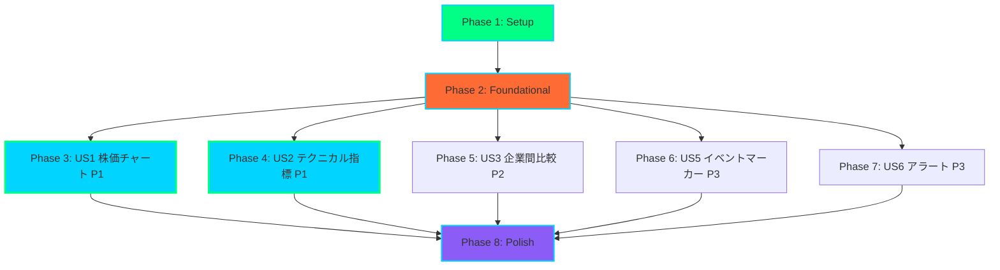
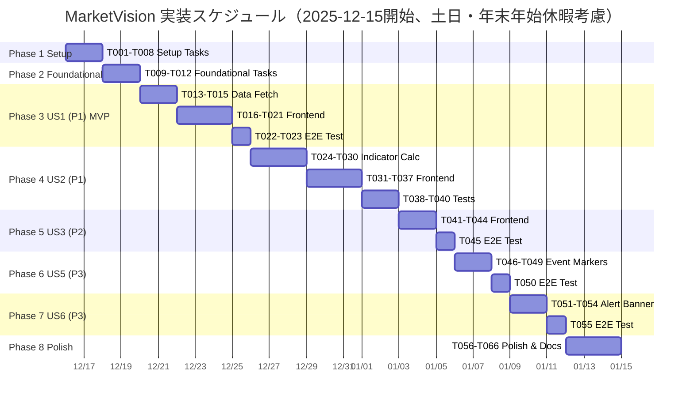

# Tasks: MarketVision 株価テクニカル分析ダッシュボード

**Input**: [plan.md](https://github.com/J1921604/MarketVision/blob/main/specs/feature/impl-001-MarketVision/plan.md), [spec.md](https://github.com/J1921604/MarketVision/blob/main/AI_input/spec.md), [data-model.md](https://github.com/J1921604/MarketVision/blob/main/specs/feature/impl-001-MarketVision/data-model.md), [contracts/](https://github.com/J1921604/MarketVision/blob/main/specs/feature/impl-001-MarketVision/contracts/)  
**Version**: 1.0.0  
**Last Updated**: 2025-12-15  
**Repository**: https://github.com/J1921604/MarketVision

## タスクフォーマット

- **Checkbox**: `- [ ]` (実行前) → `- [x]` (完了後)
- **Task ID**: T001, T002, T003... (実行順序)
- **[P] マーカー**: 並列実行可能（異なるファイル、依存関係なし）
- **[Story] ラベル**: ユーザーストーリー番号 (例: [US1], [US2], [US3])
- **Description**: 明確なアクション + 正確なファイルパス

**例**:
- ✅ `- [ ] T001 Create project structure per implementation plan`
- ✅ `- [ ] T005 [P] Implement authentication middleware in src/middleware/auth.py`
- ✅ `- [ ] T012 [P] [US1] Create User model in src/models/user.py`

---

## Phase 1: Setup（プロジェクト初期化）

**目的**: プロジェクト構造の作成と基本依存関係のインストール

- [x] T001 Create project structure (src/, scripts/, tests/, public/data/)
- [x] T002 Initialize Node.js project with package.json dependencies (React 18.2, TypeScript 5.3, Vite 5.0, Recharts 2.10, Tailwind CSS 3.4, papaparse 5.4)
- [x] T003 [P] Initialize Python environment with requirements.txt (pandas 2.1, pandas_datareader 0.10.0, numpy 1.26, pytest 7.4)
- [x] T004 [P] Configure ESLint and Prettier for code formatting
- [x] T005 [P] Setup Tailwind CSS configuration in tailwind.config.js (Cyberpunk Neumorphism theme)
- [x] T006 Configure TypeScript in tsconfig.json (strict mode, path aliases)
- [x] T007 Configure Vite in vite.config.ts (base: '/MarketVision/', build optimization)
- [x] T008 Create .gitignore (node_modules, dist, public/data/*.csv, .env)

**Checkpoint**: プロジェクト構造とビルド環境が整い、`npm run dev`と`npm run build`が動作する

---

## Phase 2: Foundational（基盤整備 - 全ユーザーストーリーの前提条件）

**目的**: すべてのユーザーストーリーが依存する共通インフラの構築

**⚠️ 重要**: このPhase完了まで、いかなるユーザーストーリーの実装も開始できない

- [x] T009 Create TypeScript type definitions in src/types/index.ts (PriceData, SMAData, RSIData, MACDData, BollingerBandData, Symbol, PeriodFilter)
- [x] T010 [P] Setup GitHub Actions workflow in .github/workflows/deploy-pages.yml (Python data fetch → build → deploy)
- [x] T011 [P] Create data directories (public/data/price/, public/data/indicators/, public/data/events/)
- [x] T012 Document manual起動手順 (npm install → Python data fetch → npm run dev)

**Checkpoint**: 型定義、CI/CD、データディレクトリが整い、ユーザーストーリー実装が開始可能

---

## Phase 3: User Story 1 - 株価チャート表示 (Priority: P1) 🎯 MVP

**Goal**: 東京電力HD・中部電力の過去10年間の株価をローソク足チャートで表示し、期間フィルタで絞り込み可能にする

**Independent Test**: Stooq (pandas_datareader) から9501.T/9502.Tのデータを取得し、ローソク足チャート（OHLC）として描画されることを確認。期間フィルタ（1M/3M/6M/1Y等）を切り替えて、データが正しく絞り込まれることを検証。

### データ取得（Python）

- [x] T013 [P] [US1] Implement fetch_price_data.py in scripts/ (Stooq経由で9501.T/9502.Tデータ取得、CSV保存 public/data/price/{symbol}.csv)
- [x] T014 [P] [US1] Implement validate_data.py in scripts/ (PriceData スキーマ検証、異常値検出、前日比±50%チェック)
- [ ] T015 [US1] Test data fetch locally (python scripts/fetch_price_data.py --symbols "9501.T,9502.T" --output public/data/price)

### フロントエンド実装

- [x] T016 [P] [US1] Create useMarketData.ts in src/hooks/ (CSV読み込み、PapaParse、期間フィルタリング、データ結合)
- [x] T017 [P] [US1] Create ChartCanvas.tsx in src/components/ (Recharts ComposedChart、ローソク足描画、出来高バーチャート)
- [x] T018 [US1] Implement App.tsx main layout (銘柄選択ボタン、期間フィルタボタン、ChartCanvas統合)
- [x] T019 [US1] Style App.tsx with Tailwind CSS (neumorphic cards, neon-green accents, responsive grid)
- [ ] T020 [US1] Add date formatting utility in src/utils/ (YYYY-MM-DD → MM/DD)
- [ ] T021 [US1] Add price formatting utility in src/utils/ (千円単位カンマ区切り)

### E2Eテスト（US1）

- [x] T022 [P] [US1] Create E2E test in tests/e2e/chart-display.spec.ts (ページ読み込み、銘柄切り替え、期間フィルタ切り替えを検証)
- [x] T023 [US1] Configure Playwright in playwright.config.ts (Chromium、baseURL、webServer設定)

**Checkpoint**: US1が完全に動作し、ローソク足チャート、銘柄切り替え、期間フィルタが独立してテスト可能

---

## Phase 4: User Story 2 - テクニカル指標の重ね表示 (Priority: P1)

**Goal**: SMA、RSI、MACD、ボリンジャーバンドを計算し、チャート上に重ね表示する。チェックボックスでON/OFF切り替え可能にする。

**Independent Test**: 株価データに対して、pandas/numpyで計算したSMA、RSI、MACD、ボリンジャーバンドの値をCSV形式で保存し、Rechartsで各指標が正しく重ね表示されることを確認。計算ロジックのユニットテストも実施。

### テクニカル指標計算（Python）

- [x] T024 [US2] Implement build_indicators.py in scripts/ (SMA 5/25/75日、RSI 14日、MACD 12/26/9、ボリンジャーバンド 20日±2σ計算、CSV保存 public/data/indicators/{symbol}_{indicator}.csv)
- [x] T025 [P] [US2] Add SMA calculation function in build_indicators.py (pandas rolling().mean())
- [x] T026 [P] [US2] Add RSI calculation function in build_indicators.py (pandas ewm()、0-100範囲検証)
- [x] T027 [P] [US2] Add MACD calculation function in build_indicators.py (12/26 EMA、9日シグナル、ヒストグラム)
- [x] T028 [P] [US2] Add Bollinger Bands calculation in build_indicators.py (20日SMA±2σ、上限>=中央>=下限検証)
- [x] T029 [US2] Update validate_data.py (IndicatorData スキーマ検証、SMA非負、RSI 0-100、MACD整合性チェック)
- [ ] T030 [US2] Test indicator calculation locally (python scripts/build_indicators.py --symbols "9501.T,9502.T" --input public/data/price --output public/data/indicators)

### フロントエンド実装

- [x] T031 [P] [US2] Update ChartCanvas.tsx (SMA 5/25/75日線追加、Recharts Line コンポーネント、色分け: 青/橙/紫)
- [x] T032 [P] [US2] Update ChartCanvas.tsx (Bollinger Bands追加、上限/中央/下限線、ピンク破線)
- [x] T033 [P] [US2] Create TechnicalPanel.tsx in src/components/ (SMA/RSI/MACD/BBチェックボックス、ON/OFF切り替え、説明テキスト)
- [x] T034 [P] [US2] Create RSIChart.tsx in src/components/ (Recharts LineChart、RSI 0-100範囲、30未満/70超過エリア色分け、ReferenceLine)
- [x] T035 [P] [US2] Create MACDChart.tsx in src/components/ (Recharts ComposedChart、MACD/Signal線、ヒストグラムBar、ゴールデンクロス説明)
- [x] T036 [US2] Update App.tsx (TechnicalPanel統合、useState for showSMA5/showSMA25/showSMA75/showRSI/showMACD/showBB)
- [x] T037 [US2] Update useMarketData.ts (SMA/RSI/MACD/BBデータ結合、Map による日付マージ)

### ユニットテスト（US2）

- [x] T038 [P] [US2] Create unit test in src/hooks/useMarketData.test.ts (getFilterDate関数、1M/3M/6M/1Y/3Y/5Y/Custom期間計算検証)
- [ ] T039 [P] [US2] Create unit test in scripts/test_build_indicators.py (SMA/RSI/MACD/BB計算ロジック、pandas DataFrame入出力検証)

### E2Eテスト（US2）

- [x] T040 [P] [US2] Create E2E test in tests/e2e/technical-indicators.spec.ts (SMA/RSI/MACDチェックボックス切り替え、チャート表示/非表示検証)

**Checkpoint**: US2が完全に動作し、SMA/RSI/MACD/BBがチャート上に正しく重ね表示され、独立してテスト可能

---

## Phase 5: User Story 3 - 企業間比較表示 (Priority: P2)

**Goal**: 東京電力HDと中部電力の株価を同一チャート上で比較表示し、凡例で個別ON/OFF可能にする

**Independent Test**: 9501.Tと9502.Tの両方のデータを読み込み、同一チャート上に異なる色で描画されることを確認。凡例で両銘柄が区別できることを検証。

### フロントエンド実装

- [ ] T041 [P] [US3] Update ChartCanvas.tsx (複数銘柄対応、Recharts Line複数描画、色分け: 9501.T=シアン、9502.T=マゼンタ)
- [ ] T042 [US3] Update App.tsx (銘柄複数選択UI、useState for selectedSymbols: Symbol[]、「比較追加」ボタン)
- [ ] T043 [US3] Update useMarketData.ts (複数銘柄データ並列読み込み、Promise.all、データ配列返却)
- [ ] T044 [US3] Add legend click handler in ChartCanvas.tsx (Recharts Legend onClick、銘柄の一時非表示機能)

### E2Eテスト（US3）

- [ ] T045 [P] [US3] Create E2E test in tests/e2e/comparison.spec.ts (2銘柄同時表示、凡例クリックで非表示、期間フィルタ同期検証)

**Checkpoint**: US3が完全に動作し、2銘柄の比較表示、凡例操作が独立してテスト可能

---

## Phase 6: User Story 5 - イベントマーカー表示 (Priority: P3)

**Goal**: 決算発表日・権利落ち日などの重要イベントをチャート上にアイコンマーカーで表示し、ホバー時に詳細をポップアップ

**Independent Test**: `corporate_events.json`ファイルにイベントデータを登録し、該当日付のチャート上にアイコンマーカーが表示されることを確認。マーカーホバー時にイベント詳細がポップアップすることを検証。

### データ準備

- [ ] T046 [P] [US5] Create corporate_events.json in public/data/events/ (決算日、権利落ち日、イベント種別、ラベル、JSONSchema準拠)

### フロントエンド実装

- [ ] T047 [P] [US5] Create EventMarker.tsx in src/components/ (Recharts ReferenceDot、アイコン表示、ホバーツールチップ)
- [ ] T048 [US5] Update ChartCanvas.tsx (EventMarker統合、イベントデータ読み込み、日付マッピング)
- [ ] T049 [US5] Update useMarketData.ts (events.json読み込み、fetch API、JSON.parse)

### E2Eテスト（US5）

- [ ] T050 [P] [US5] Create E2E test in tests/e2e/event-markers.spec.ts (マーカー表示、ホバーツールチップ、イベント詳細テキスト検証)

**Checkpoint**: US5が完全に動作し、イベントマーカー表示、ホバーツールチップが独立してテスト可能

---

## Phase 7: User Story 6 - ±5%価格変動アラート (Priority: P3)

**Goal**: 前日比±5%以上の急激な価格変動があった場合、ダッシュボード上部にアラートバナーを表示

**Independent Test**: 過去データから前日比±5%を超える日付を抽出し、`alerts.json`に記録。ダッシュボード読み込み時にアラートバナーが表示されることを確認。

### データ準備

- [ ] T051 [US6] Update validate_data.py (前日比±5%検出ロジック、alerts.json生成、タイムスタンプ・銘柄・変動率・終値記録)

### フロントエンド実装

- [ ] T052 [P] [US6] Create AlertBanner.tsx in src/components/ (赤色バナー、⚠️アイコン、変動率表示、「×」閉じるボタン)
- [ ] T053 [US6] Update App.tsx (AlertBanner統合、alerts.json読み込み、最新3件表示、useState for dismissedAlerts)
- [ ] T054 [US6] Add alert dismiss handler in App.tsx (localStorage永続化、リロード後も閉じた状態を維持)

### E2Eテスト（US6）

- [ ] T055 [P] [US6] Create E2E test in tests/e2e/alerts.spec.ts (アラートバナー表示、「×」ボタンクリック非表示、複数アラート表示検証)

**Checkpoint**: US6が完全に動作し、アラートバナー表示、閉じる機能が独立してテスト可能

---

## Phase 8: Polish & Cross-Cutting Concerns（最終仕上げ）

**目的**: 全ユーザーストーリーに影響する横断的な改善

- [ ] T056 [P] Update README.md (クイックスタート、技術スタック、デプロイ手順、パフォーマンス基準、GitHub リポジトリリンク)
- [ ] T057 [P] Update quickstart.md (手動起動手順更新、public/data/price・public/data/indicatorsパス反映)
- [ ] T058 Code cleanup and refactoring (不要なコンソールログ削除、コメント追加、命名規則統一)
- [ ] T059 [P] Performance optimization (Vite build optimization、Recharts lazy loading、初期バンドル<200KB確認)
- [ ] T060 [P] Add unit tests in src/utils/ (date/price formatting関数、エッジケース検証)
- [ ] T061 Security hardening (.env.local除外確認、CSVインジェクション対策、XSS対策)
- [ ] T062 Run quickstart.md validation (手動コマンドで5分以内に起動しブラウザ表示を確認)
- [ ] T063 [P] Add Lighthouse CI workflow in .github/workflows/ (LCP<2.5秒、TTI<2.0秒、スコア≥90検証)
- [ ] T064 [P] Update all internal links in docs (ローカルパスをGitHub https://github.com/J1921604/MarketVision/blob/main/ に変更)
- [ ] T065 Run full E2E test suite (npm run test:e2e、全シナリオ100%成功確認)
- [ ] T066 Run unit test suite with coverage (npm run test:coverage、カバレッジ≥80%確認)

**Checkpoint**: 全ユーザーストーリーが完全に動作し、パフォーマンス基準達成、テスト100%成功、ドキュメント完全

---

## Dependencies & Execution Order（依存関係と実行順序）

### Phase Dependencies（フェーズ依存関係）



- **Setup (Phase 1)**: 依存なし - 即座に開始可能
- **Foundational (Phase 2)**: Setup完了後 - **すべてのユーザーストーリーをブロック**
- **User Stories (Phase 3-7)**: すべてFoundational完了後に開始可能
  - US1（P1）: 依存なし - Foundational後すぐ開始可能
  - US2（P1）: US1と並列可能だが、実際はChartCanvas.tsx更新で統合
  - US3（P2）: US1完了推奨（ChartCanvas拡張）
  - US5（P3）: US1完了推奨（ChartCanvas拡張）
  - US6（P3）: 独立実行可能
- **Polish (Phase 8)**: 全ユーザーストーリー完了後

### User Story Dependencies（ユーザーストーリー依存関係）

| User Story | 依存関係 | 並列実行可否 | 理由 |
|-----------|---------|------------|------|
| **US1 株価チャート (P1)** | Foundational完了のみ | ✅ 並列可 | 完全独立、他ストーリー不要 |
| **US2 テクニカル指標 (P1)** | US1推奨（実際は統合） | ⚠️ US1後推奨 | ChartCanvas.tsx拡張、独立テスト可能だが実装は統合 |
| **US3 企業間比較 (P2)** | US1完了推奨 | ⚠️ US1後推奨 | ChartCanvas.tsx複数銘柄対応、独立テスト可能 |
| **US5 イベントマーカー (P3)** | US1完了推奨 | ⚠️ US1後推奨 | ChartCanvas.tsx EventMarker統合 |
| **US6 アラート (P3)** | Foundational完了のみ | ✅ 並列可 | 完全独立、App.tsx上部バナーのみ |

### Within Each User Story（各ユーザーストーリー内）

1. **データ準備（Python）**: まず実データ取得・計算スクリプト実装
2. **フロントエンド実装**: データ読み込みフック → コンポーネント → App.tsx統合
3. **テスト**: E2Eテスト（主要フロー）、ユニットテスト（計算ロジック）
4. **Checkpoint**: ストーリー完全動作確認後、次のストーリーへ

### Parallel Opportunities（並列実行機会）

#### Phase 1 Setup（並列可能タスク）
```bash
# 同時実行可能（異なるファイル）
T003: requirements.txt
T004: ESLint/Prettier設定
T005: Tailwind CSS設定
```

#### Phase 2 Foundational（並列可能タスク）
```bash
# 同時実行可能（異なるファイル）
T010: GitHub Actions workflow
T011: データディレクトリ作成
```

#### Phase 3 US1（並列可能タスク）
```bash
# データ取得とフロントエンド並列
T013: fetch_price_data.py
T014: validate_data.py
T016: useMarketData.ts
T017: ChartCanvas.tsx

# テスト並列
T022: E2Eテスト（Playwrightが独立ファイル）
```

#### Phase 4 US2（並列可能タスク）
```bash
# 指標計算関数並列
T025: SMA計算
T026: RSI計算
T027: MACD計算
T028: Bollinger Bands計算

# フロントエンドコンポーネント並列
T031: ChartCanvas SMA追加
T032: ChartCanvas BB追加
T033: TechnicalPanel.tsx
T034: RSIChart.tsx
T035: MACDChart.tsx

# テスト並列
T038: useMarketData.test.ts
T039: test_build_indicators.py
T040: technical-indicators.spec.ts
```

#### 複数ユーザーストーリー並列（チーム複数人の場合）
```bash
# Foundational完了後、複数人で並列実装可能
開発者A: US1 株価チャート（T013-T023）
開発者B: US6 アラート（T051-T055） # 独立実行可能
```

---

## Parallel Example: User Story 2（並列実行例）

```bash
# US2テクニカル指標の並列実行例（4つのターミナル）

# Terminal 1: SMA + RSI計算実装
cd scripts
code build_indicators.py  # T025, T026実装

# Terminal 2: MACD + BB計算実装
cd scripts
code build_indicators.py  # T027, T028実装

# Terminal 3: RSIChart実装
cd src/components
code RSIChart.tsx  # T034実装

# Terminal 4: MACDChart実装
cd src/components
code MACDChart.tsx  # T035実装

# 全並列タスク完了後、統合タスクに進む
# T029: validate_data.py更新（T025-T028完了待ち）
# T036: App.tsx統合（T034, T035完了待ち）
```

---

## Implementation Strategy（実装戦略）

### MVP First Approach（MVP優先アプローチ）

1. **MVP = Phase 1 + Phase 2 + Phase 3 (US1)**
   - 株価チャート表示だけで最小限の価値提供
   - デプロイ可能な状態を早期達成

2. **Incremental Delivery（段階的デリバリー）**
   - US1完了 → デプロイ → フィードバック
   - US2追加 → デプロイ → フィードバック
   - US3以降を順次追加

3. **Test-Driven Development（TDD）**
   - 各ユーザーストーリーでE2Eテスト先行
   - 計算ロジックはユニットテスト必須
   - CI/CDでテスト自動実行

4. **Independent Story Completion（独立ストーリー完成）**
   - 各ユーザーストーリーは独立してテスト可能
   - Checkpoint到達まで次のストーリーに進まない
   - バグ修正は該当ストーリー内で完結

---

## Gantt Chart（ガントチャート - 相対日付方式）

**開始日**: 2025-12-15（日曜）  
**休日考慮**: 土日・年末年始（12/28-1/5）を除外  
**作業日数**: 1タスク = 0.5～2営業日想定



### スケジュール計算ロジック（相対日付方式）

1. **開始日**: `START_DATE = 2025-12-15`（ユーザー指定、任意変更可能）
2. **営業日計算**: 土日・年末年始（12/28-1/5）を除外
3. **各Phaseの終了日**: 前Phase終了日 + 営業日数
4. **並列タスク**: 同一Phase内で最長タスクの日数を採用

#### 営業日カウント例（2025-12-15開始）

| Phase | タスク範囲 | 営業日数 | 開始日 | 終了日 |
|-------|----------|---------|--------|--------|
| Phase 1 | T001-T008 | 2日 | 12/16（月） | 12/17（火） |
| Phase 2 | T009-T012 | 2日 | 12/18（水） | 12/19（木） |
| Phase 3 | T013-T023 | 6日 | 12/20（金） | 12/27（金） |
| Phase 4 | T024-T040 | 8日 | 1/6（月）※ | 1/15（水） |
| Phase 5 | T041-T045 | 3日 | 1/16（木） | 1/20（月） |
| Phase 6 | T046-T050 | 3日 | 1/21（火） | 1/23（木） |
| Phase 7 | T051-T055 | 3日 | 1/24（金） | 1/28（火） |
| Phase 8 | T056-T066 | 3日 | 1/29（水） | 1/31（金） |

※ 12/28-1/5は年末年始休暇のため、12/27（金）完了後、1/6（月）から再開

**総営業日数**: 30営業日（約6週間）  
**完成予定日**: 2025-01-31（金）

### スケジュール変更方法

開始日を変更する場合、`START_DATE`を更新すれば全日程が自動再計算されます。

```python
# スケジュール再計算スクリプト例
from datetime import datetime, timedelta

START_DATE = datetime(2025, 12, 15)  # ここを変更
HOLIDAYS = [  # 土日以外の休日
    datetime(2025, 12, 28), datetime(2025, 12, 29),
    datetime(2025, 12, 30), datetime(2025, 12, 31),
    datetime(2026, 1, 1), datetime(2026, 1, 2),
    datetime(2026, 1, 3), datetime(2026, 1, 4),
    datetime(2026, 1, 5)
]

def add_business_days(start, days):
    current = start
    added = 0
    while added < days:
        current += timedelta(days=1)
        if current.weekday() < 5 and current not in HOLIDAYS:  # 月-金 & 休日でない
            added += 1
    return current

# Phase毎の日数
phase_days = {
    'Phase 1': 2,
    'Phase 2': 2,
    'Phase 3': 6,
    'Phase 4': 8,
    'Phase 5': 3,
    'Phase 6': 3,
    'Phase 7': 3,
    'Phase 8': 3
}

current_date = START_DATE
for phase, days in phase_days.items():
    end_date = add_business_days(current_date, days)
    print(f"{phase}: {current_date.strftime('%Y-%m-%d')} → {end_date.strftime('%Y-%m-%d')}")
    current_date = end_date
```

---

## Version History（バージョン履歴）

| Version | Date | Changes |
|---------|------|---------|
| 1.0.0 | 2025-12-15 | 初版リリース - 全Phase定義、ガントチャート、並列実行例追加 |

---

**Repository**: https://github.com/J1921604/MarketVision  
**Version**: 1.0.0  
**Last Updated**: 2025-12-15
